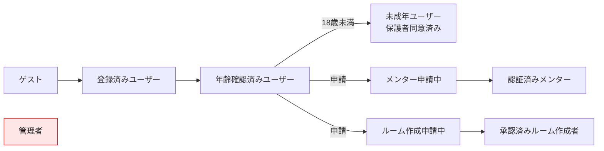
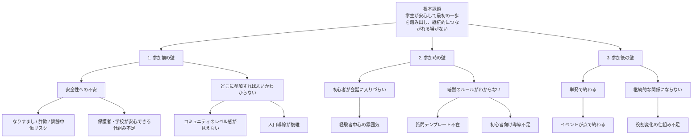
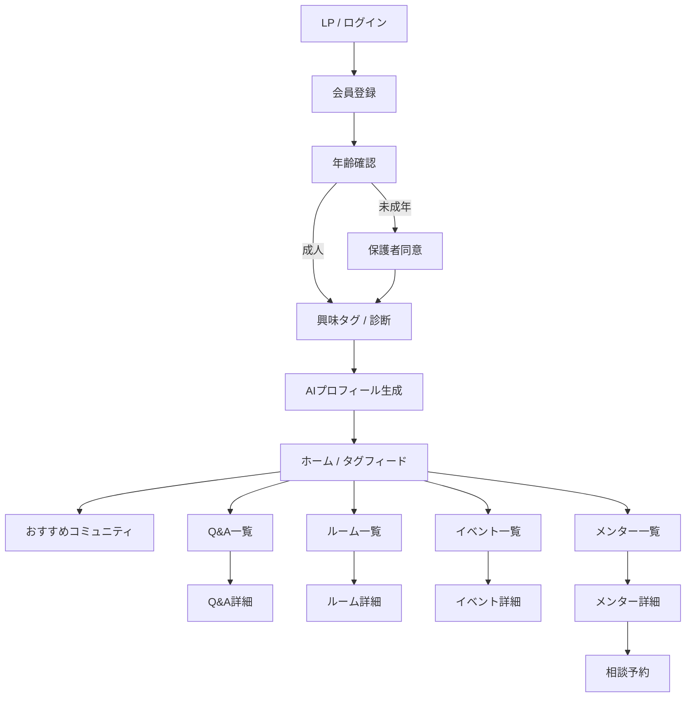
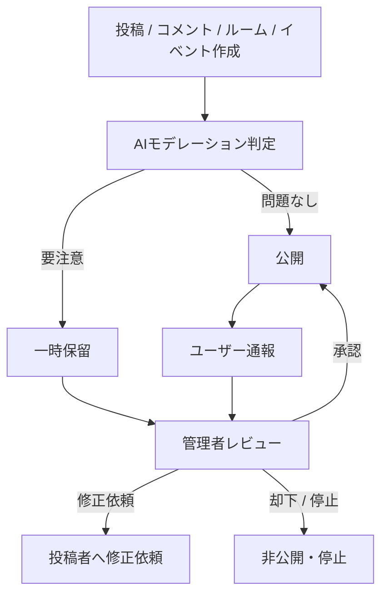
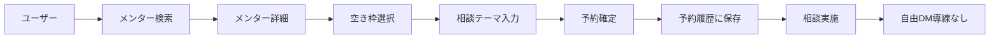
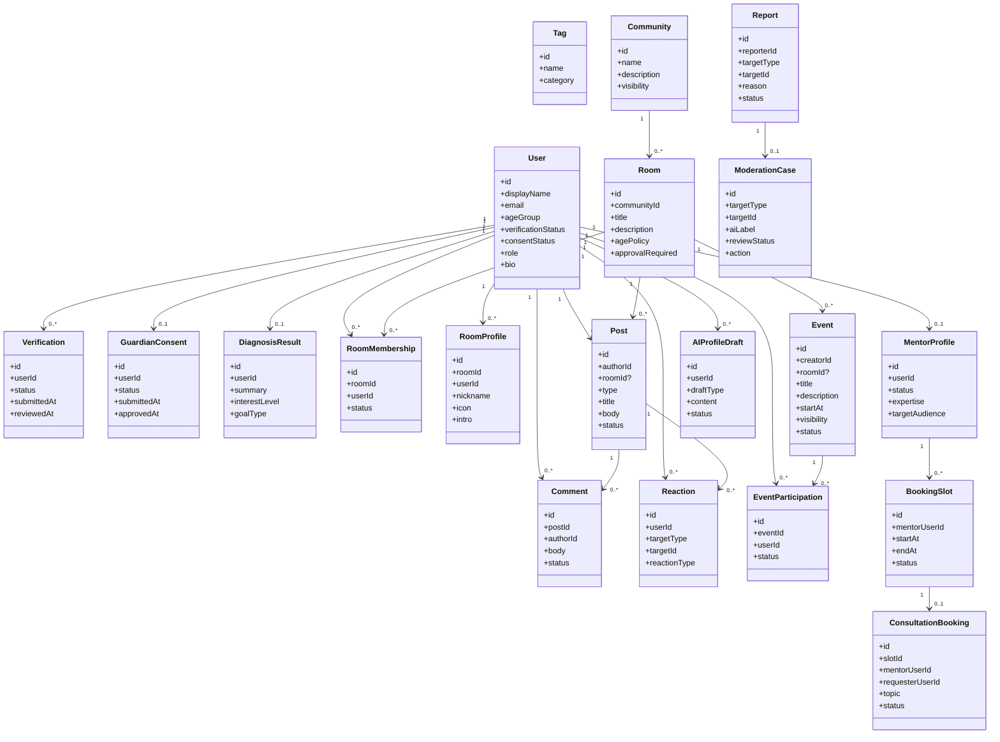
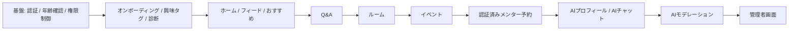

# Claude実装用 要件定義書  
## 学生向け「挑戦・学び・相談」コミュニティプラットフォーム MVP

- 文書種別: PRD + 機能要件定義書
- 利用目的: Claude に実装させる際の一次仕様書
- スコープ: 実際に触れる Web MVP
- 記述方針: 技術非依存
- 主対象: 日本の大学生
- 補足: 未成年ユーザーの受け入れを見据え、年齢確認と保護者同意フローを含む

---

## 0. この文書の位置づけ

本書は、ハッカソンテーマである「学生の生活を豊かにするプロダクト」を前提に、**大学生を主要対象としながら、年齢横断的な学び・相談・挑戦の接点を安全に成立させるサービス**を、Claude が実装可能な粒度まで整理した要件定義書である。

本書で定める内容は以下を優先する。

1. 学生目線での価値提供
2. 安全設計を前提にしたプロダクト体験
3. 実際に触れる MVP としての実装可能性
4. 将来的な中高生・社会人拡張を阻害しない情報設計

### 0.1 実装前提の整理

- 初期リリースの主要対象は**大学生**
- ただし、将来的な年齢横断利用を見据え、**未成年向けの年齢確認・保護者同意・制限付き導線**を MVP から持つ
- **非監督の私的 DM は禁止**
- **監査可能な予約制相談のみ許可**
- **AI 活用は価値増幅のために使うが、運営判断の最終責任は人間が持つ**
- **相互推薦 / 実績表示**は MVP 対象外とする
- **AI による過疎コミュニティ活性化**は MVP 対象外とする

---

## 1. プロダクトの要約

### 1.1 一言でいうと

**興味ベースで学生をつなぎ、安全に最初の一歩を踏み出せる、学び・相談・挑戦のコミュニティプラットフォーム**

### 1.2 解く課題

このプロダクトが解く中心課題は次の 3 つである。

1. **参加前の壁**  
   どこに参加すればよいかわからず、初心者が最初の一歩を踏み出せない

2. **参加時の壁**  
   経験者中心の空気や暗黙のルールによって、初心者が萎縮する

3. **参加後の壁**  
   単発の接点で終わり、継続的な関係や居場所にならない

### 1.3 提供価値

- 学生が安心して学び・相談・交流を始められる
- 興味タグと診断により、最初に入るべきコミュニティがわかる
- 公開 Q&A、ルーム、イベント、予約制相談を通じて、継続的な関係が生まれる
- 安全性を担保したうえで、年齢や属性を越えた接点を設計できる

---

## 2. 目標と非目標

### 2.1 MVP の目標

- 学生が**登録から初回アクション**まで迷わず進める
- 興味ベースで**おすすめコミュニティ**に到達できる
- **公開 Q&A / ルーム / イベント / 予約制相談**が最低限成立する
- AI により**プロフィール作成支援、チャット支援、モデレーション補助**が機能する
- 管理者が**通報、審査、承認、停止、NG ワード設定**を操作できる

### 2.2 非目標

- フル機能の SNS 化
- 自由な 1 対 1 DM
- 実績証明や推薦の精緻な信用スコア設計
- 課金・広告・学校法人向け導入フローの本格実装
- 画像 / 動画中心の複雑なメディアプラットフォーム化

### 2.3 成功指標（MVP 段階）

- 新規登録者のオンボーディング完了率
- オンボーディング完了後の初回アクション率  
  （初回アクション = ルーム参加 / Q&A 閲覧 / 投稿 / イベント参加 / 相談予約のいずれか）
- 7 日継続率
- 通報件数に対する対応完了率
- AI モデレーションの一次検知精度
- 相談予約の完了率

---

## 3. ユーザー定義

### 3.1 主要ペルソナ

**大学 1〜3 年生の「意欲はあるが、最初の一歩が踏み出せない学生」**

特徴:
- 新しいコミュニティや学びには興味がある
- ただし、いきなり強いコミュニティに入るのは不安
- 就活、勉強、制作、趣味、ハッカソンなど、興味はあるが入口が見えない
- 安全性、雰囲気、参加しやすさを重視する

### 3.2 サブ対象

- 高校生 / 中学生  
  ただし、MVP では利用制限付きで扱う
- 大学生上級生、大学院生、社会人メンター
- 管理者 / モデレーター

### 3.3 ユーザーロール

| ロール | 概要 |
|---|---|
| ゲスト | 未登録ユーザー。閲覧範囲は限定 |
| 一般ユーザー | 登録済みユーザー |
| 年齢確認済みユーザー | 年齢確認を完了した利用者 |
| 未成年ユーザー | 年齢確認済みかつ保護者同意が完了した未成年 |
| 認証済みメンター | 運営審査を通過し、予約制相談を受けられるユーザー |
| ルーム作成者 | 承認されたルームを作成・管理できるユーザー |
| 管理者 | 審査、通報対応、停止、設定変更を行う運営ユーザー |

### 3.4 ロール遷移図

### 3.5 権限マトリクス

| 操作 | ゲスト | 一般ユーザー | 年齢確認済み | 未成年 | 認証済みメンター | 管理者 |
|---|---|---:|---:|---:|---:|---:|
| 会員登録 | ○ | - | - | - | - | - |
| フィード閲覧 | 一部 | ○ | ○ | ○ | ○ | ○ |
| Q&A 投稿 | - | - | ○ | ○ | ○ | ○ |
| ルーム参加 | - | - | ○ | ○ | ○ | ○ |
| ルーム作成申請 | - | - | ○ | - | ○ | ○ |
| イベント作成 | - | - | ○ | 制限付き | ○ | ○ |
| 相談予約申込 | - | - | ○ | 認証済みメンターのみ | - | ○ |
| 相談受付 | - | - | - | - | ○ | ○ |
| 通報 | - | ○ | ○ | ○ | ○ | ○ |
| 審査 / 停止 / NG ワード設定 | - | - | - | - | - | ○ |

---

## 4. 課題構造のロジックツリー

### 4.1 課題に対する解決の基本方針

| 課題層 | 解決方針 |
|---|---|
| 参加前 | 年齢確認、保護者同意、診断、興味タグ、コミュニティ推薦 |
| 参加時 | 初心者向け UI、テンプレ付き投稿、ROM 導線、ルーム専用プロフィール |
| 参加後 | ルーム、イベント、相談予約、再訪しやすい構造 |

---

## 5. プロダクト原則

1. **Student First**  
   企業都合ではなく、学生が入りやすい体験を優先する

2. **Safety by Design**  
   危険行為を禁止事項にするだけでなく、構造的に起きにくくする

3. **Interest First**  
   年齢より先に、興味タグと目的でつながる

4. **Lurk Before Speak**  
   最初は見るだけでも価値がある設計にする

5. **Auditable Interaction**  
   個別接触は監査可能な形に限定する

6. **Simple First**  
   実際に触れる MVP として、UI と導線は最小限に保つ

---

## 6. MVP スコープ

### 6.1 MVP に含める機能

- 会員登録 / ログイン
- 年齢確認 / 保護者同意
- 興味タグ選択 / 簡易診断
- おすすめコミュニティ表示
- タグフィード閲覧
- 公開 Q&A 投稿 / コメント / リアクション
- ルーム参加 / ルーム専用プロフィール
- イベント作成 / 参加
- 認証済みメンターへの予約制相談
- AI チャットサポート
- AI モデレーション
- AI プロフィール生成
- 管理者機能  
  - 通報管理  
  - 本人確認審査  
  - メンター審査  
  - コミュニティ作成承認  
  - イベント監視 / 停止  
  - NG ワード / モデレーション設定

### 6.2 MVP 対象外

- 非監督の私的 DM
- 相互推薦 / 実績表示
- AI による過疎コミュニティ活性化
- 本格的な収益化機能
- 学校管理者専用ポータル
- 高度な推薦アルゴリズム
- 複数言語対応
- 画像 / 動画投稿の高度編集

---

## 7. 情報アーキテクチャ

### 7.1 主要画面一覧

| 画面 | 目的 |
|---|---|
| LP / ログイン | 登録導線 |
| 会員登録 | 基本属性入力 |
| 年齢確認 | 本人確認・年齢区分確定 |
| 保護者同意 | 未成年向け同意取得 |
| 興味タグ / 診断 | 初期パーソナライズ |
| ホーム / タグフィード | 主体験の起点 |
| おすすめコミュニティ | 最初の参加先提示 |
| Q&A 一覧 / 詳細 | 公開相談体験 |
| 投稿作成 | テンプレ付き質問投稿 |
| ルーム一覧 / 詳細 | 継続的な居場所 |
| ルーム専用プロフィール編集 | 心理的安全性の確保 |
| イベント一覧 / 詳細 / 作成 | 学びの接点形成 |
| メンター一覧 / 詳細 / 予約 | 安全な 1on1 相談 |
| 自分のプロフィール | 基本プロフィール管理 |
| AI サポート | 壁打ち・質問補助 |
| 通知 | 予約・承認・通報対応など |
| 管理者ダッシュボード | 審査と監視 |

### 7.2 画面遷移図

---

## 8. 安全設計ポリシー

### 8.1 絶対ルール

1. **非監督の私的 DM を禁止する**
2. **相談は監査可能な予約制導線上でのみ許可する**
3. **全ユーザーに最低限の年齢確認を必須とする**
4. **未成年は保護者同意を必須とする**
5. **メンター / コミュニティ作成者 / イベント主催者には追加審査を課す**
6. **外部 SNS の ID 交換・URL 交換を禁止する**
7. **違反が疑われる投稿は AI と人間運営の両方で判定する**

### 8.2 相談導線ルール

- 予約制相談の受け手は認証済みメンターのみ
- 未成年ユーザーは認証済みメンターにのみ相談可能
- 相談は、日時、当事者、相談テーマ、予約ステータスが記録される
- 相談後の自由 DM への誘導は禁止
- 運営は必要に応じて相談履歴メタデータを参照できる  
  ※本文や録画の常時取得は必須ではないが、予約ログは保持する

### 8.3 モデレーションフロー

---

## 9. 機能要件

以下では、Claude が実装対象を明確にできるよう、機能ごとに要求事項を定義する。

### 9.1 認証 / アカウント

#### 目的
登録から利用開始までの導線を簡潔にし、本人性と最低限の利用資格を担保する。

| ID | 要件 | 優先度 |
|---|---|---|
| FR-AUTH-01 | ユーザーは新規会員登録できること | Must |
| FR-AUTH-02 | 登録時にメールアドレス確認を行えること | Must |
| FR-AUTH-03 | ログイン / ログアウト / パスワード再設定ができること | Must |
| FR-AUTH-04 | 初回登録時に、表示名、年齢区分、所属区分、興味タグの初期入力ができること | Must |
| FR-AUTH-05 | 利用規約、プライバシーポリシー、安全ポリシーへの同意取得ができること | Must |

#### 受け入れ基準
- 会員登録完了後、未確認メール状態では主要機能が制限される
- メール確認後にオンボーディングへ進める
- 未ログイン時に投稿・予約等の操作を行うとログイン導線へ遷移する

---

### 9.2 年齢確認 / 保護者同意

#### 目的
安全設計の起点として、利用者の年齢区分を確定し、未成年に適切な制限をかける。

| ID | 要件 | 優先度 |
|---|---|---|
| FR-VERIFY-01 | 全ユーザーは年齢確認フローを完了しないと主要機能を利用できないこと | Must |
| FR-VERIFY-02 | 年齢確認の結果、成人 / 未成年の区分が保存されること | Must |
| FR-VERIFY-03 | 未成年ユーザーは保護者同意を完了するまで投稿、イベント作成、相談申込などの一部機能が制限されること | Must |
| FR-VERIFY-04 | 保護者同意の取得記録が保持されること | Must |
| FR-VERIFY-05 | 管理者が年齢確認状態・保護者同意状態をレビューできること | Must |

#### 受け入れ基準
- 年齢未確認ユーザーは閲覧中心の制限状態になる
- 未成年で保護者同意未完了の場合、制限理由が明確に表示される
- 管理者画面から審査状態を承認 / 差戻しできる

---

### 9.3 興味タグ選択 / 簡易診断 / 初期パーソナライズ

#### 目的
「どこに参加すればよいかわからない」を解消する。

| ID | 要件 | 優先度 |
|---|---|---|
| FR-ONB-01 | 初回利用時に興味タグを複数選択できること | Must |
| FR-ONB-02 | 簡易診断により、興味・目的・温度感を入力できること | Must |
| FR-ONB-03 | 入力結果をもとに、おすすめコミュニティ / ルーム / Q&A が提示されること | Must |
| FR-ONB-04 | 診断結果は後から再編集できること | Should |
| FR-ONB-05 | 初回は ROM 専モードに入りやすい導線を持つこと | Must |

#### 受け入れ基準
- タグ / 診断を完了すると、ホーム上におすすめが表示される
- 「質問する前に見る」導線が明確に存在する
- ユーザーが診断をスキップした場合でも最低限のホームは表示される

---

### 9.4 ホーム / タグフィード / おすすめコミュニティ

#### 目的
ホーム画面を「最初の村」への入口にする。

| ID | 要件 | 優先度 |
|---|---|---|
| FR-FEED-01 | ホーム画面に興味タグベースのフィードが表示されること | Must |
| FR-FEED-02 | おすすめコミュニティ / ルーム / イベント / メンターが表示されること | Must |
| FR-FEED-03 | タグやカテゴリで絞り込みできること | Must |
| FR-FEED-04 | ユーザーは気になるコンテンツに対して閲覧、いいね、保存に相当する軽い反応ができること | Should |
| FR-FEED-05 | 危険タグ、禁止行為、相談導線などの安全ガイドをホームから確認できること | Must |

#### 受け入れ基準
- 初回ホームで 1 つ以上のおすすめ導線が表示される
- 興味タグを変更すると、ホーム内容に反映される
- 軽い反応だけでも参加感が得られる

---

### 9.5 公開 Q&A 投稿 / コメント / リアクション

#### 目的
初心者が安全に質問し、他者の知見を得られる中心機能にする。

| ID | 要件 | 優先度 |
|---|---|---|
| FR-QA-01 | ユーザーは公開 Q&A を投稿できること | Must |
| FR-QA-02 | 投稿時にテンプレート入力欄を表示できること | Must |
| FR-QA-03 | 他ユーザーは回答コメントを投稿できること | Must |
| FR-QA-04 | いいね等の軽いリアクションができること | Must |
| FR-QA-05 | 投稿にタグ付けできること | Must |
| FR-QA-06 | 投稿の通報、編集、削除ができること | Must |
| FR-QA-07 | AI モデレーションにより、危険投稿は保留または警告対象にできること | Must |

#### 受け入れ基準
- 投稿フォームに「今困っていること」「試したこと」等のガイドが表示される
- 危険語句を含む投稿は即時公開されないか、明示的な警告が出る
- 投稿者は自分の投稿を編集 / 削除できる

---

### 9.6 ルーム参加 / ルーム専用プロフィール

#### 目的
公開 Q&A より少し継続的で、心理的安全性の高い居場所をつくる。

| ID | 要件 | 優先度 |
|---|---|---|
| FR-ROOM-01 | ユーザーはルーム一覧を閲覧し、参加申請または参加できること | Must |
| FR-ROOM-02 | ルームには説明、タグ、参加条件、公開範囲を設定できること | Must |
| FR-ROOM-03 | ユーザーはルームごとに専用プロフィールを設定できること | Must |
| FR-ROOM-04 | ルーム内では専用ニックネーム / アイコンが表示されること | Must |
| FR-ROOM-05 | 年齢条件付きルームや承認制ルームを作成できること | Must |
| FR-ROOM-06 | ルーム作成は申請・承認制とすること | Must |
| FR-ROOM-07 | ルーム内投稿も AI / 通報対象になること | Must |

#### 受け入れ基準
- ルームに参加すると、ルーム専用プロフィール設定導線が出る
- 承認制ルームでは未承認のまま閲覧範囲が制限される
- 未成年が不許可ルームに入れない

---

### 9.7 イベント作成 / 参加

#### 目的
コミュニティを点ではなく線にする。

| ID | 要件 | 優先度 |
|---|---|---|
| FR-EVT-01 | ユーザーはイベント一覧を閲覧できること | Must |
| FR-EVT-02 | 権限を持つユーザーはイベントを作成できること | Must |
| FR-EVT-03 | イベントにはタイトル、説明、日時、開催形式、関連タグ、主催者情報を設定できること | Must |
| FR-EVT-04 | ユーザーはイベント参加 / キャンセルができること | Must |
| FR-EVT-05 | 管理者は危険または不適切なイベントを停止できること | Must |
| FR-EVT-06 | 未成年ユーザーに対し、参加可能イベントの制限設定ができること | Must |

#### 受け入れ基準
- イベント作成後、一覧に表示される
- 参加者は自身の参加状態を確認できる
- 管理者が停止するとイベント詳細に停止状態が反映される

---

### 9.8 認証済みメンターへの予約制相談

#### 目的
安全性を担保しつつ、1on1 相当の相談価値を提供する。

| ID | 要件 | 優先度 |
|---|---|---|
| FR-MTR-01 | ユーザーは認証済みメンター一覧を閲覧できること | Must |
| FR-MTR-02 | メンター詳細では、専門領域、対応テーマ、対象者、空き枠を確認できること | Must |
| FR-MTR-03 | ユーザーはカレンダー形式または一覧形式で相談枠を予約できること | Must |
| FR-MTR-04 | 相談予約には、相談テーマ、希望内容、予約日時、双方ステータスが保存されること | Must |
| FR-MTR-05 | 非認証ユーザー同士では相談予約機能を使えないこと | Must |
| FR-MTR-06 | 未成年ユーザーが予約できる相手は、条件を満たす認証済みメンターに限定されること | Must |
| FR-MTR-07 | 相談完了後も、自由 DM への接続導線を出さないこと | Must |

#### 受け入れ基準
- 認証済みメンターでないユーザーは相談受付導線を持てない
- 予約は一覧またはカレンダーから直感的に行える
- 予約履歴がユーザーと管理者に残る

### 9.8.1 相談導線図

---

### 9.9 AI チャットサポート

#### 目的
初心者の行動前の壁打ちを支援し、投稿やイベント作成のハードルを下げる。

| ID | 要件 | 優先度 |
|---|---|---|
| FR-AI-CHAT-01 | ユーザーは AI チャットサポートを利用できること | Must |
| FR-AI-CHAT-02 | AI は「質問文の整理」「どのタグを選ぶべきか」「どのコミュニティが向いているか」等を支援できること | Must |
| FR-AI-CHAT-03 | Q&A 投稿前に、AI が質問文の改善案を提案できること | Should |
| FR-AI-CHAT-04 | イベント作成時に、AI が説明文の叩き台を出せること | Should |
| FR-AI-CHAT-05 | AI の回答には安全上の注意文を表示できること | Must |

#### 受け入れ基準
- AI は少なくとも「タグ選択支援」「質問文の整理」「イベント文案支援」のいずれかを提供する
- AI 回答はそのまま送信せず、ユーザーが採用 / 編集できる

---

### 9.10 AI プロフィール生成

#### 目的
自己表現が苦手なユーザーでもプロフィールを作りやすくする。

| ID | 要件 | 優先度 |
|---|---|---|
| FR-AI-PROF-01 | 興味タグ、診断結果、自己入力をもとに AI がプロフィール草案を生成できること | Must |
| FR-AI-PROF-02 | ユーザーは草案を編集して保存できること | Must |
| FR-AI-PROF-03 | ルーム専用プロフィールにも応用できること | Should |
| FR-AI-PROF-04 | 不適切な自己表現や禁止文言を AI が避けること | Must |

#### 受け入れ基準
- 生成プロフィールをそのまま公開するのではなく、必ず確認ステップを挟む
- 保存後、公開プロフィールに反映される

---

### 9.11 AI モデレーション

#### 目的
危険行為の一次検知を自動化し、運営負荷を下げる。

| ID | 要件 | 優先度 |
|---|---|---|
| FR-AI-MOD-01 | 投稿、コメント、ルーム説明、イベント説明、プロフィール文を AI で判定できること | Must |
| FR-AI-MOD-02 | NG ワード、年齢差リスク、外部連絡先誘導、不適切表現を検知対象に含めること | Must |
| FR-AI-MOD-03 | AI は判定結果を「公開可 / 要注意 / 保留」等で返せること | Must |
| FR-AI-MOD-04 | 保留対象は管理者レビューキューに送られること | Must |
| FR-AI-MOD-05 | AI 判定結果と管理者判断を履歴として保持できること | Must |

#### 受け入れ基準
- 外部 SNS ID 交換を示唆する投稿は警告または保留になる
- 年齢差リスクが高い組み合わせを検知した場合、追加確認または制限がかかる
- AI 誤判定時に管理者が上書き可能である

---

### 9.12 管理者機能

#### 目的
安全運営を実行可能にする。

| ID | 要件 | 優先度 |
|---|---|---|
| FR-ADMIN-01 | 管理者は通報一覧を確認し、ステータス管理できること | Must |
| FR-ADMIN-02 | 管理者は年齢確認 / 保護者同意の審査状態を確認・更新できること | Must |
| FR-ADMIN-03 | 管理者はメンター申請を承認 / 却下できること | Must |
| FR-ADMIN-04 | 管理者はルーム作成申請を承認 / 却下できること | Must |
| FR-ADMIN-05 | 管理者はイベントを監視し、停止 / 非公開化できること | Must |
| FR-ADMIN-06 | 管理者は NG ワードやモデレーションルールを更新できること | Must |
| FR-ADMIN-07 | 管理者はユーザー停止、投稿削除、注意喚起などのアクションを実行できること | Must |
| FR-ADMIN-08 | 管理者アクションは監査ログに記録されること | Must |

#### 受け入れ基準
- 管理者ダッシュボードに、審査待ち / 通報 / 保留コンテンツが一覧化される
- 1 件ごとに状態遷移が見える
- 操作履歴が残る

---

### 9.13 通知 / 履歴

#### 目的
利用者が自分の状態変化を見失わないようにする。

| ID | 要件 | 優先度 |
|---|---|---|
| FR-NOTI-01 | 予約、承認、却下、通報結果などの主要イベント通知を表示できること | Must |
| FR-NOTI-02 | ユーザーは自分の予約履歴、参加イベント、所属ルームを確認できること | Must |
| FR-NOTI-03 | 管理者は主要審査タスクの未処理件数を確認できること | Must |

#### 受け入れ基準
- 少なくともアプリ内通知または通知一覧画面が存在する
- 相談予約や承認結果がユーザーに見える

---

## 10. ドメインモデル

---

## 11. 主要ユースケース

### 11.1 新規ユーザーの初回体験

1. ユーザーが登録する
2. 年齢確認を行う
3. 未成年の場合は保護者同意を行う
4. 興味タグと簡易診断を行う
5. AI がプロフィール草案を提案する
6. ホームにおすすめコミュニティが表示される
7. ユーザーは Q&A 閲覧、ルーム参加、イベント閲覧、相談先閲覧のいずれかを行う

### 11.2 質問投稿

1. ユーザーが Q&A 投稿画面を開く
2. テンプレに沿って質問内容を入力する
3. AI モデレーションが一次判定する
4. 問題なければ公開、要注意なら保留または警告
5. 他ユーザーが回答やリアクションを行う

### 11.3 相談予約

1. ユーザーが認証済みメンターを検索する
2. メンター詳細から空き枠を選ぶ
3. 相談テーマを入力して予約する
4. 予約履歴に保存される
5. 実施後も自由 DM 導線は表示しない

### 11.4 管理者の審査対応

1. 管理者が保留コンテンツまたは通報を確認する
2. AI 判定とユーザー情報を見ながら判断する
3. 承認 / 差戻し / 非公開 / 停止を行う
4. 判断履歴が監査ログに残る

---

## 12. 非機能要件

| ID | 要件 | 優先度 |
|---|---|---|
| NFR-01 | モバイルファーストで利用できること | Must |
| NFR-02 | 一般的な通信環境で主要画面が体感的にストレスなく表示されること | Must |
| NFR-03 | 安全関連アクションは監査ログを保持すること | Must |
| NFR-04 | 個人情報、年齢確認情報、保護者同意情報は通常プロフィール情報より強い保護対象として扱うこと | Must |
| NFR-05 | 禁止行為や利用制限は UI 上で明示されること | Must |
| NFR-06 | 不正アクセスや権限外操作を防ぐアクセス制御があること | Must |
| NFR-07 | フォーム、ボタン、エラー表示など基本的なアクセシビリティを担保すること | Should |
| NFR-08 | AI 判定失敗時でも、人手レビューにフォールバックできること | Must |
| NFR-09 | 主要画面で致命的な未処理エラーにより遷移不能にならないこと | Must |
| NFR-10 | 将来的に中高生比率が増えても年齢別制御を追加できる設計であること | Should |

---

## 13. 画面別の最低実装要件

### 13.1 ユーザー向け

- ログイン / 会員登録画面
- 年齢確認画面
- 保護者同意画面
- 興味タグ / 診断画面
- ホーム / フィード画面
- Q&A 一覧 / 詳細 / 投稿画面
- ルーム一覧 / 詳細 / 参加画面
- ルーム専用プロフィール編集画面
- イベント一覧 / 詳細 / 作成画面
- メンター一覧 / 詳細 / 予約画面
- プロフィール画面
- AI サポート画面
- 通知 / 履歴画面

### 13.2 管理者向け

- 管理者ログイン
- ダッシュボード
- 通報管理画面
- 年齢確認 / 保護者同意審査画面
- メンター審査画面
- ルーム作成承認画面
- イベント監視 / 停止画面
- NG ワード / モデレーション設定画面
- 監査ログ画面

---

## 14. Claude への実装指示時の優先順位

実装順は以下を推奨する。

### 優先順位の考え方

1. **安全の基盤**
2. **初回体験**
3. **公開コミュニケーション**
4. **継続接点**
5. **個別相談**
6. **AI 支援**
7. **運営管理**

---

## 15. リスクと設計上の注意点

### 15.1 プロダクトリスク

- 大学生中心で設計しないと、全年齢対応が先に立ち UX がぼやける
- 安全性を重くしすぎると登録完了率が落ちる
- AI への依存を強めすぎると、誤判定時の体験悪化が起きる
- イベントと相談を同時に入れると導線が散る

### 15.2 設計上の原則

- 公開導線 → 半公開導線 → 予約制導線の順に深くなる構造を守る
- 未成年制御は「禁止文」ではなく「権限設計」で担保する
- AI は代替ではなく補助に徹する
- MVP では機能の横展開より、迷わず使える導線を優先する

---

## 16. 将来拡張の余地

本 MVP では対象外だが、将来拡張しやすいように設計余地を残す。

- 相互推薦 / 実績表示
- 学校別・年代別の厳密な空間分離
- 学校 / 教育機関の公式導入モデル
- AI によるコミュニティ活性化
- 高度な推薦エンジン
- 外部カレンダー / ビデオ会議連携
- 学習記録、プロジェクト記録、ポートフォリオ連携

---

## 17. 最終要約

この MVP の本質は、**「興味ベースでつながれるが、危険な自由交流にはしない」**ことにある。  
よって、Claude に実装させる際も、次の 3 点を崩してはならない。

1. **最初の一歩が踏み出しやすいこと**
2. **安全設計が構造的に組み込まれていること**
3. **Q&A、ルーム、イベント、予約制相談が一つの体験としてつながっていること**

以上を本 MVP の実装原則とする。
