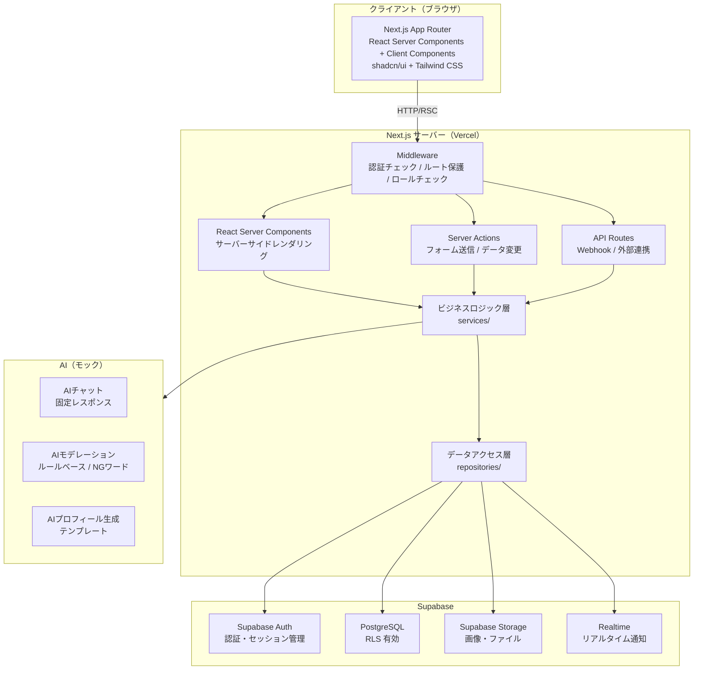
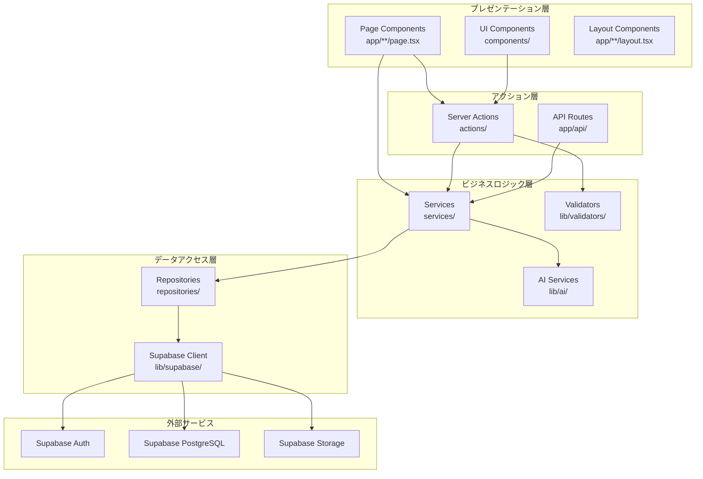
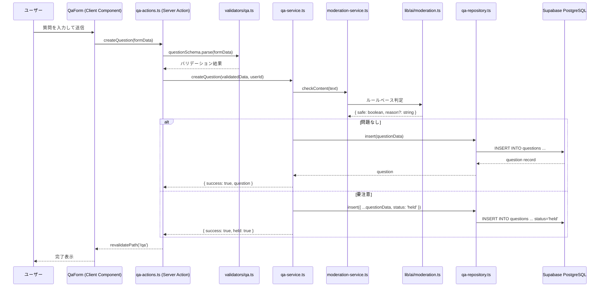
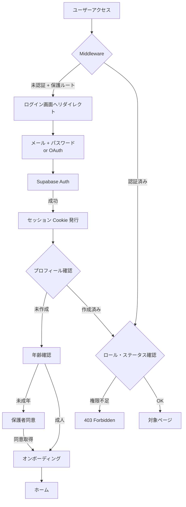
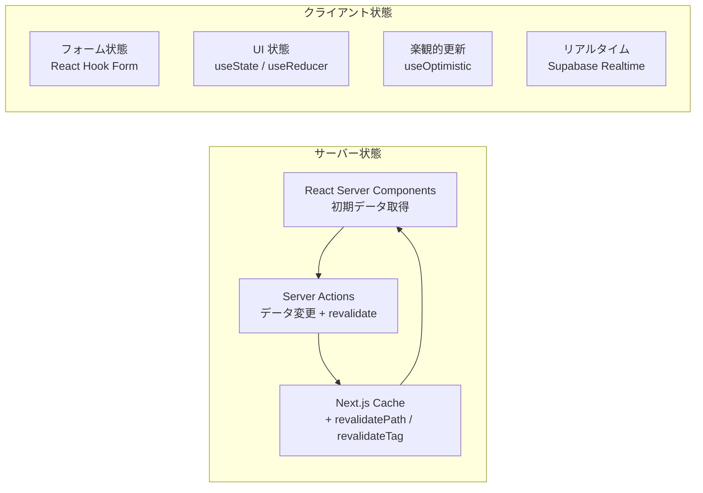

# システムアーキテクチャ設計書

## 1. 全体アーキテクチャ概要



### 設計方針

- **Server Components ファースト**: データ取得は可能な限り Server Components で行い、クライアントバンドルを最小化する
- **Server Actions によるミューテーション**: フォーム送信・データ変更は Server Actions を使用し、API Routes は Webhook 等の外部連携に限定する
- **Supabase RLS（Row Level Security）**: データベースレベルでアクセス制御を実施し、アプリケーション層との二重防御とする
- **AI はモック実装**: MVP 段階では固定レスポンスとルールベース判定で実装し、将来の LLM 統合に備えたインターフェースを定義する

---

## 2. ディレクトリ構成

```
src/
├── app/                          # App Router ルーティング
│   ├── (auth)/                   # 認証関連（レイアウトグループ）
│   │   ├── login/
│   │   │   └── page.tsx
│   │   ├── register/
│   │   │   └── page.tsx
│   │   ├── verify-age/
│   │   │   └── page.tsx
│   │   ├── parental-consent/
│   │   │   └── page.tsx
│   │   └── layout.tsx            # 認証画面共通レイアウト
│   │
│   ├── (onboarding)/             # オンボーディング（レイアウトグループ）
│   │   ├── interests/
│   │   │   └── page.tsx
│   │   ├── diagnosis/
│   │   │   └── page.tsx
│   │   ├── profile-generation/
│   │   │   └── page.tsx
│   │   └── layout.tsx
│   │
│   ├── (main)/                   # メイン画面（レイアウトグループ）
│   │   ├── home/
│   │   │   └── page.tsx
│   │   ├── feed/
│   │   │   └── page.tsx
│   │   ├── qa/
│   │   │   ├── page.tsx          # Q&A 一覧
│   │   │   ├── new/
│   │   │   │   └── page.tsx      # Q&A 新規投稿
│   │   │   └── [id]/
│   │   │       └── page.tsx      # Q&A 詳細
│   │   ├── rooms/
│   │   │   ├── page.tsx          # ルーム一覧
│   │   │   ├── new/
│   │   │   │   └── page.tsx      # ルーム作成申請
│   │   │   └── [id]/
│   │   │       ├── page.tsx      # ルーム詳細
│   │   │       └── profile/
│   │   │           └── page.tsx  # ルーム専用プロフィール
│   │   ├── events/
│   │   │   ├── page.tsx
│   │   │   ├── new/
│   │   │   │   └── page.tsx
│   │   │   └── [id]/
│   │   │       └── page.tsx
│   │   ├── mentors/
│   │   │   ├── page.tsx          # メンター一覧
│   │   │   ├── [id]/
│   │   │   │   └── page.tsx      # メンター詳細
│   │   │   └── book/
│   │   │       └── [mentorId]/
│   │   │           └── page.tsx  # 予約画面
│   │   ├── ai-chat/
│   │   │   └── page.tsx          # AI チャット（モック）
│   │   ├── profile/
│   │   │   └── page.tsx          # マイプロフィール
│   │   ├── notifications/
│   │   │   └── page.tsx
│   │   └── layout.tsx            # メイン画面共通レイアウト（ナビゲーション等）
│   │
│   ├── (admin)/                  # 管理者画面（レイアウトグループ）
│   │   ├── admin/
│   │   │   ├── page.tsx          # ダッシュボード
│   │   │   ├── reports/
│   │   │   │   └── page.tsx      # 通報管理
│   │   │   ├── reviews/
│   │   │   │   └── page.tsx      # 審査（メンター / ルーム / イベント）
│   │   │   ├── users/
│   │   │   │   └── page.tsx      # ユーザー管理
│   │   │   ├── moderation/
│   │   │   │   └── page.tsx      # NGワード / モデレーション設定
│   │   │   └── layout.tsx
│   │   └── layout.tsx            # 管理者画面共通レイアウト
│   │
│   ├── api/                      # API Routes
│   │   ├── webhooks/
│   │   │   └── supabase/
│   │   │       └── route.ts      # Supabase Webhook
│   │   └── moderation/
│   │       └── route.ts          # モデレーション API
│   │
│   ├── layout.tsx                # ルートレイアウト
│   ├── page.tsx                  # LP
│   ├── not-found.tsx
│   └── error.tsx
│
├── components/                   # UI コンポーネント
│   ├── ui/                       # shadcn/ui コンポーネント（自動生成）
│   ├── layout/                   # レイアウト系
│   │   ├── header.tsx
│   │   ├── sidebar.tsx
│   │   ├── bottom-nav.tsx        # モバイルナビ
│   │   └── footer.tsx
│   ├── auth/                     # 認証関連
│   │   ├── login-form.tsx
│   │   ├── register-form.tsx
│   │   ├── age-verification-form.tsx
│   │   └── parental-consent-form.tsx
│   ├── qa/                       # Q&A 関連
│   │   ├── qa-list.tsx
│   │   ├── qa-detail.tsx
│   │   ├── qa-form.tsx
│   │   └── comment-section.tsx
│   ├── rooms/                    # ルーム関連
│   ├── events/                   # イベント関連
│   ├── mentors/                  # メンター関連
│   ├── feed/                     # フィード関連
│   ├── admin/                    # 管理者関連
│   └── shared/                   # 共通コンポーネント
│       ├── tag-selector.tsx
│       ├── reaction-buttons.tsx
│       ├── report-button.tsx
│       └── loading-skeleton.tsx
│
├── lib/                          # ライブラリ・ユーティリティ
│   ├── supabase/
│   │   ├── client.ts             # ブラウザ用 Supabase クライアント
│   │   ├── server.ts             # サーバー用 Supabase クライアント
│   │   ├── middleware.ts         # Middleware 用 Supabase クライアント
│   │   └── admin.ts             # Service Role クライアント（管理用）
│   ├── auth/
│   │   ├── session.ts            # セッション取得ヘルパー
│   │   └── roles.ts             # ロール判定ヘルパー
│   ├── ai/
│   │   ├── chat.ts              # AI チャット（モック）
│   │   ├── moderation.ts        # ルールベースモデレーション
│   │   └── profile-generator.ts # プロフィール生成（モック）
│   ├── validators/              # Zod スキーマ
│   │   ├── auth.ts
│   │   ├── qa.ts
│   │   ├── room.ts
│   │   ├── event.ts
│   │   └── booking.ts
│   └── utils.ts                 # 汎用ユーティリティ
│
├── services/                    # ビジネスロジック層
│   ├── auth-service.ts
│   ├── user-service.ts
│   ├── qa-service.ts
│   ├── room-service.ts
│   ├── event-service.ts
│   ├── booking-service.ts
│   ├── moderation-service.ts
│   ├── notification-service.ts
│   └── admin-service.ts
│
├── repositories/                # データアクセス層
│   ├── user-repository.ts
│   ├── qa-repository.ts
│   ├── room-repository.ts
│   ├── event-repository.ts
│   ├── booking-repository.ts
│   ├── report-repository.ts
│   └── tag-repository.ts
│
├── types/                       # 型定義
│   ├── database.ts              # Supabase 生成型
│   ├── auth.ts
│   ├── qa.ts
│   ├── room.ts
│   ├── event.ts
│   └── booking.ts
│
├── hooks/                       # カスタムフック（クライアント用）
│   ├── use-auth.ts
│   ├── use-realtime.ts
│   └── use-notifications.ts
│
├── constants/                   # 定数
│   ├── roles.ts
│   ├── permissions.ts
│   ├── ng-words.ts
│   └── routes.ts
│
├── actions/                     # Server Actions
│   ├── auth-actions.ts
│   ├── qa-actions.ts
│   ├── room-actions.ts
│   ├── event-actions.ts
│   ├── booking-actions.ts
│   ├── moderation-actions.ts
│   └── admin-actions.ts
│
└── middleware.ts                # Next.js Middleware（ルート保護）
```

### ディレクトリ設計の根拠

| 方針 | 理由 |
|---|---|
| `app/` 内は Route Groups `(auth)`, `(main)`, `(admin)` で分離 | レイアウトを用途別に切り替え、URL パスに影響を与えずに構造化できる |
| `services/` と `repositories/` を分離 | ビジネスロジックとデータアクセスの関心を分離し、テスト容易性を確保する |
| `actions/` を独立ディレクトリに配置 | Server Actions をページから分離し、再利用性と見通しを向上させる |
| `lib/supabase/` に4種のクライアントを配置 | ブラウザ / サーバー / Middleware / Admin で異なる認証コンテキストを持つため |
| `components/` は機能ドメイン別にサブディレクトリ | コンポーネントの発見性と責務の明確化 |

---

## 3. レイヤーアーキテクチャ



### 各層の責務

| 層 | 責務 | 許可される依存先 |
|---|---|---|
| **プレゼンテーション層** | UI 描画、ユーザー操作のハンドリング、Server Component でのデータ取得 | アクション層、ビジネスロジック層（Server Component からの読み取りのみ） |
| **アクション層** | 入力バリデーション、認証チェック、ビジネスロジックの呼び出し | ビジネスロジック層 |
| **ビジネスロジック層** | ドメインルールの適用、複数リポジトリの調整、AI 機能の呼び出し | データアクセス層、AI サービス |
| **データアクセス層** | Supabase への CRUD 操作、クエリの構築 | Supabase クライアント |

### データフロー例: Q&A 投稿



---

## 4. 認証・認可フロー

### 4.1 認証フロー全体図



### 4.2 Supabase Auth の構成

```typescript
// lib/supabase/server.ts - サーバーコンポーネント用
import { createServerClient } from '@supabase/ssr'
import { cookies } from 'next/headers'

export async function createClient() {
  const cookieStore = await cookies()
  return createServerClient(
    process.env.NEXT_PUBLIC_SUPABASE_URL!,
    process.env.NEXT_PUBLIC_SUPABASE_ANON_KEY!,
    {
      cookies: {
        getAll() {
          return cookieStore.getAll()
        },
        setAll(cookiesToSet) {
          cookiesToSet.forEach(({ name, value, options }) =>
            cookieStore.set(name, value, options)
          )
        },
      },
    }
  )
}
```

```typescript
// lib/supabase/middleware.ts - Middleware 用
import { createServerClient } from '@supabase/ssr'
import { NextResponse, type NextRequest } from 'next/server'

export async function updateSession(request: NextRequest) {
  let supabaseResponse = NextResponse.next({ request })
  const supabase = createServerClient(
    process.env.NEXT_PUBLIC_SUPABASE_URL!,
    process.env.NEXT_PUBLIC_SUPABASE_ANON_KEY!,
    {
      cookies: {
        getAll() {
          return request.cookies.getAll()
        },
        setAll(cookiesToSet) {
          cookiesToSet.forEach(({ name, value }) =>
            request.cookies.set(name, value)
          )
          supabaseResponse = NextResponse.next({ request })
          cookiesToSet.forEach(({ name, value, options }) =>
            supabaseResponse.cookies.set(name, value, options)
          )
        },
      },
    }
  )
  const { data: { user } } = await supabase.auth.getUser()
  return { user, supabaseResponse }
}
```

### 4.3 セッション管理

- **方式**: Supabase Auth の Cookie ベースセッション（`@supabase/ssr` 使用）
- **トークンリフレッシュ**: Middleware 内で自動リフレッシュ
- **セッション有効期間**: Supabase デフォルト（1時間、リフレッシュ可能）

---

## 5. ロールベースアクセス制御（RBAC）

### 5.1 ロール定義

```typescript
// constants/roles.ts
export const ROLES = {
  GUEST: 'guest',
  USER: 'user',
  VERIFIED: 'verified',
  MINOR: 'minor',
  MENTOR: 'mentor',
  ROOM_CREATOR: 'room_creator',
  ADMIN: 'admin',
} as const

export type Role = (typeof ROLES)[keyof typeof ROLES]
```

### 5.2 ロール判定ロジック

ロールは `profiles` テーブルの複数フィールドから導出する。単一カラムではなく、状態の組み合わせで判定する。

```typescript
// lib/auth/roles.ts
import { ROLES, type Role } from '@/constants/roles'

interface UserProfile {
  id: string
  age_verified: boolean
  birth_date: string | null
  parental_consent: boolean
  is_mentor: boolean
  is_room_creator: boolean
  is_admin: boolean
  onboarding_completed: boolean
}

export function resolveRoles(profile: UserProfile): Role[] {
  const roles: Role[] = [ROLES.USER]

  if (profile.is_admin) {
    roles.push(ROLES.ADMIN)
  }

  if (!profile.age_verified) {
    return roles  // 年齢確認未完了 → USER のみ
  }

  roles.push(ROLES.VERIFIED)

  if (profile.birth_date) {
    const age = calculateAge(profile.birth_date)
    if (age < 18 && profile.parental_consent) {
      roles.push(ROLES.MINOR)
    }
  }

  if (profile.is_mentor) {
    roles.push(ROLES.MENTOR)
  }

  if (profile.is_room_creator) {
    roles.push(ROLES.ROOM_CREATOR)
  }

  return roles
}

export function hasRole(roles: Role[], required: Role): boolean {
  return roles.includes(required)
}

export function hasAnyRole(roles: Role[], required: Role[]): boolean {
  return required.some(r => roles.includes(r))
}
```

### 5.3 権限マトリクス（実装対応表）

```typescript
// constants/permissions.ts
import { ROLES, type Role } from './roles'

type Permission =
  | 'feed:read'
  | 'qa:read' | 'qa:create' | 'qa:comment'
  | 'room:read' | 'room:join' | 'room:create'
  | 'event:read' | 'event:join' | 'event:create'
  | 'mentor:read' | 'booking:create' | 'booking:accept'
  | 'ai-chat:use'
  | 'report:create'
  | 'admin:access'

export const ROLE_PERMISSIONS: Record<Role, Permission[]> = {
  [ROLES.GUEST]:       ['feed:read'],
  [ROLES.USER]:        ['feed:read', 'report:create'],
  [ROLES.VERIFIED]:    ['feed:read', 'qa:read', 'qa:create', 'qa:comment',
                        'room:read', 'room:join', 'room:create',
                        'event:read', 'event:join', 'event:create',
                        'mentor:read', 'booking:create',
                        'ai-chat:use', 'report:create'],
  [ROLES.MINOR]:       ['feed:read', 'qa:read', 'qa:create', 'qa:comment',
                        'room:read', 'room:join',
                        'event:read', 'event:join',
                        'mentor:read', 'booking:create',
                        'ai-chat:use', 'report:create'],
  [ROLES.MENTOR]:      ['booking:accept'],
  [ROLES.ROOM_CREATOR]:['room:create'],
  [ROLES.ADMIN]:       ['admin:access'],
}
```

**注意**: `MINOR` ロールはルーム作成・イベント作成の権限を持たない。`MENTOR` と `ROOM_CREATOR` は追加ロールであり、`VERIFIED` の権限に加算される。

### 5.4 Supabase RLS との連携

アプリケーション層の RBAC に加え、Supabase の RLS（Row Level Security）でデータベースレベルの保護を行う。

```sql
-- 例: questions テーブルの RLS ポリシー
ALTER TABLE questions ENABLE ROW LEVEL SECURITY;

-- 年齢確認済みユーザーのみ投稿可能
CREATE POLICY "verified_users_can_insert_questions"
ON questions FOR INSERT
TO authenticated
WITH CHECK (
  EXISTS (
    SELECT 1 FROM profiles
    WHERE profiles.id = auth.uid()
    AND profiles.age_verified = true
  )
);

-- 公開済みの質問は誰でも閲覧可能
CREATE POLICY "anyone_can_read_published_questions"
ON questions FOR SELECT
USING (status = 'published');
```

---

## 6. Middleware 戦略

### 6.1 処理フロー

```mermaid
flowchart TD
    REQ[リクエスト] --> STATIC{静的ファイル?}
    STATIC -->|Yes| PASS[そのまま通過]
    STATIC -->|No| REFRESH[セッションリフレッシュ]
    REFRESH --> PUBLIC{公開ルート?}
    PUBLIC -->|Yes| PASS
    PUBLIC -->|No| AUTH{認証済み?}
    AUTH -->|No| REDIRECT_LOGIN[/login へリダイレクト]
    AUTH -->|Yes| ONBOARD{オンボーディング<br/>完了?}
    ONBOARD -->|No| REDIRECT_ONBOARD[/verify-age へリダイレクト]
    ONBOARD -->|Yes| ADMIN{/admin ルート?}
    ADMIN -->|Yes| IS_ADMIN{管理者?}
    IS_ADMIN -->|No| FORBIDDEN[403]
    IS_ADMIN -->|Yes| PASS
    ADMIN -->|No| PASS
```

### 6.2 実装

```typescript
// src/middleware.ts
import { type NextRequest, NextResponse } from 'next/server'
import { updateSession } from '@/lib/supabase/middleware'

// 公開ルート（認証不要）
const PUBLIC_ROUTES = ['/', '/login', '/register']

// 認証済みだがオンボーディング未完了でもアクセス可能なルート
const ONBOARDING_ROUTES = ['/verify-age', '/parental-consent', '/interests', '/diagnosis', '/profile-generation']

// 管理者専用ルート
const ADMIN_ROUTES = ['/admin']

export async function middleware(request: NextRequest) {
  const { pathname } = request.nextUrl

  // 1. セッションリフレッシュ
  const { user, supabaseResponse } = await updateSession(request)

  // 2. 公開ルートはそのまま通過
  if (PUBLIC_ROUTES.some(route => pathname === route || pathname.startsWith(route + '/'))) {
    return supabaseResponse
  }

  // 3. 未認証 → ログインへリダイレクト
  if (!user) {
    const url = request.nextUrl.clone()
    url.pathname = '/login'
    url.searchParams.set('redirectTo', pathname)
    return NextResponse.redirect(url)
  }

  // 4. オンボーディングルートは認証済みなら通過
  if (ONBOARDING_ROUTES.some(route => pathname.startsWith(route))) {
    return supabaseResponse
  }

  // 5. 管理者ルートのチェック（profiles テーブルの is_admin を参照）
  // ※ Middleware では重いDB問い合わせを避け、JWT カスタムクレームで判定する
  if (ADMIN_ROUTES.some(route => pathname.startsWith(route))) {
    const isAdmin = user.app_metadata?.is_admin === true
    if (!isAdmin) {
      const url = request.nextUrl.clone()
      url.pathname = '/home'
      return NextResponse.redirect(url)
    }
  }

  return supabaseResponse
}

export const config = {
  matcher: [
    // 静的ファイル・画像・favicon を除外
    '/((?!_next/static|_next/image|favicon.ico|.*\\.(?:svg|png|jpg|jpeg|gif|webp)$).*)',
  ],
}
```

### 6.3 詳細な権限チェック戦略

Middleware は**軽量な認証チェックとルート保護**に留め、詳細な権限チェックは以下の場所で行う。

| チェック内容 | 実施場所 | 理由 |
|---|---|---|
| 認証状態（ログイン有無） | Middleware | 全ルートに一律適用するため |
| 管理者かどうか | Middleware（JWT クレーム） | Admin ルートへのアクセスを高速に拒否するため |
| 年齢確認・オンボーディング完了 | Server Component / Server Action | DB アクセスが必要なため Middleware には重い |
| 機能単位の権限（投稿、作成等） | Server Action / Service 層 | ビジネスロジックに近い判定のため |
| データ単位のアクセス制御 | Supabase RLS | データベースレベルでの最終防御 |

---

## 7. 状態管理

### 7.1 基本方針

**サーバー状態を中心に据え、クライアント状態を最小化する。**



### 7.2 状態の分類と管理手法

| 状態の種類 | 管理方法 | 例 |
|---|---|---|
| **サーバーデータ（読み取り）** | React Server Components で直接取得 | Q&A 一覧、ルーム情報、ユーザープロフィール |
| **サーバーデータ（書き込み）** | Server Actions + `revalidatePath` | 投稿作成、プロフィール更新、予約作成 |
| **フォーム入力** | React Hook Form + Zod | 登録フォーム、投稿フォーム、検索フォーム |
| **UI 表示状態** | `useState` / `useReducer` | モーダル開閉、タブ切替、アコーディオン |
| **楽観的更新** | `useOptimistic`（React 19） | リアクション追加、コメント投稿 |
| **認証状態** | Supabase Auth + Cookie | ログイン状態、セッション情報 |
| **リアルタイム通知** | Supabase Realtime + `useEffect` | 新規通知、予約ステータス変更 |
| **URL 状態** | `searchParams` / `useSearchParams` | フィルター条件、ページネーション、タグ絞り込み |

### 7.3 グローバル状態ストアを使わない理由

MVP の規模では、Next.js App Router の機能（Server Components、Server Actions、URL state）で十分にカバーでき、Redux / Zustand 等のグローバル状態管理ライブラリは不要と判断する。

- **データ取得**: Server Components が担う（SWR / TanStack Query も不要）
- **ミューテーション**: Server Actions + `revalidatePath` で再取得
- **クロスコンポーネント状態**: URL searchParams で管理
- **認証情報**: Server Component 内で `supabase.auth.getUser()` を呼び出す

---

## 8. 主要な設計判断と根拠

### 8.1 技術選定

| 判断 | 選択 | 根拠 |
|---|---|---|
| フレームワーク | Next.js App Router | SSR/RSC によるパフォーマンス、Server Actions によるフルスタック開発の効率化 |
| UI ライブラリ | shadcn/ui + Tailwind CSS | コピー&ペースト方式で完全にカスタマイズ可能、ブラックボックスにならない |
| BaaS | Supabase | Auth / DB / Storage / Realtime を統合提供、RLS による堅牢なアクセス制御、無料枠で MVP に十分 |
| バリデーション | Zod | TypeScript ファーストのスキーマ定義、Server Actions との統合が容易 |
| フォーム管理 | React Hook Form | パフォーマンスに優れ、Zod との連携が公式サポート |

### 8.2 アーキテクチャ判断

| 判断 | 選択 | 根拠 |
|---|---|---|
| API Routes vs Server Actions | Server Actions 主体 | フォーム送信やデータ変更の大半はページ内で完結し、REST API を別途設計する必要がない。API Routes は Webhook 等に限定 |
| モノリス vs マイクロサービス | モノリス（Next.js 単一プロジェクト） | MVP の規模ではモノリスが最も開発速度が速く、デプロイも簡単 |
| ORM vs クエリビルダー | Supabase Client（クエリビルダー） | Supabase の型生成と直接統合でき、追加の ORM 層が不要 |
| グローバル状態管理 | 不使用 | Server Components + Server Actions + URL state で十分カバーできる |
| ロール管理 | 複合フィールド導出方式 | 単一 enum よりも柔軟。メンターかつルーム作成者のような複合ロールに対応可能 |
| Middleware の責務範囲 | 認証チェック + ルート保護のみ | 重い DB 問い合わせは避け、詳細な権限チェックは Server Component / Server Action 層に委譲 |

### 8.3 安全設計に関する判断

| 判断 | 実装方針 | 根拠 |
|---|---|---|
| DM 機能 | 実装しない | 安全設計ルール「非監督の私的 DM 禁止」に従い、構造的に DM 機能を持たない |
| 相談機能 | 予約制 + メタデータ記録 | 監査可能性を確保。日時・当事者・テーマ・ステータスを記録 |
| テキスト投稿 | 投稿前にルールベースモデレーション通過 | NGワードおよびパターンマッチで一次判定し、要注意は保留状態にして管理者レビューへ |
| 外部 SNS 情報 | モデレーションルールで検知 | URL パターン、SNS ID パターンをルールベースで検出し、投稿をブロック |
| RLS | 全テーブルに有効化 | アプリケーション層のバグがあっても DB レベルでデータ漏洩を防止 |
| 未成年保護 | 年齢確認 + 保護者同意を必須フロー化 | オンボーディングフローに組み込み、完了しないと機能にアクセスできない |

### 8.4 AI モック実装方針

MVP では AI 機能を全てモック実装とし、将来の LLM 統合に備えたインターフェースを定義する。

```typescript
// lib/ai/moderation.ts - ルールベースモデレーション
interface ModerationResult {
  safe: boolean
  reason?: string
  confidence: number
}

interface ModerationService {
  checkContent(text: string): Promise<ModerationResult>
}

// MVP 実装: NGワードリスト + 正規表現パターンマッチ
export class RuleBasedModeration implements ModerationService {
  async checkContent(text: string): Promise<ModerationResult> {
    // NGワードチェック
    // SNS URL / ID パターンチェック
    // 個人情報パターンチェック
    // ...
  }
}

// 将来実装: LLM ベースのモデレーション
// export class LLMModeration implements ModerationService { ... }
```

```typescript
// lib/ai/chat.ts - AI チャットモック
interface ChatMessage {
  role: 'user' | 'assistant'
  content: string
}

interface ChatService {
  sendMessage(messages: ChatMessage[]): Promise<ChatMessage>
}

// MVP 実装: キーワードに基づく固定レスポンス
export class MockChatService implements ChatService {
  async sendMessage(messages: ChatMessage[]): Promise<ChatMessage> {
    const lastMessage = messages[messages.length - 1]
    const response = this.getFixedResponse(lastMessage.content)
    return { role: 'assistant', content: response }
  }
  // ...
}
```

---

## 9. デプロイ・環境構成

### 9.1 環境変数

```env
# Supabase
NEXT_PUBLIC_SUPABASE_URL=
NEXT_PUBLIC_SUPABASE_ANON_KEY=
SUPABASE_SERVICE_ROLE_KEY=        # サーバーサイドのみ、管理操作用

# Next.js
NEXT_PUBLIC_SITE_URL=
```

### 9.2 デプロイ先

- **アプリケーション**: Vercel（Next.js のネイティブホスティング）
- **データベース / Auth / Storage**: Supabase（マネージド）
- **環境**: Development / Production の 2 環境構成（MVP 段階）

---

## 10. 今後の拡張ポイント

| 領域 | MVP | 将来 |
|---|---|---|
| AI モデレーション | ルールベース（NGワード + パターン） | LLM ベースのコンテキスト理解 |
| AI チャット | 固定レスポンス | LLM 統合 |
| AI プロフィール | テンプレート埋め込み | LLM による自然言語生成 |
| 通知 | Supabase Realtime + ポーリング | Push 通知（Service Worker） |
| 検索 | Supabase full-text search | 専用検索エンジン（Algolia 等） |
| ファイルアップロード | Supabase Storage | CDN + 画像最適化パイプライン |
| モニタリング | Vercel Analytics | Sentry + カスタムダッシュボード |
