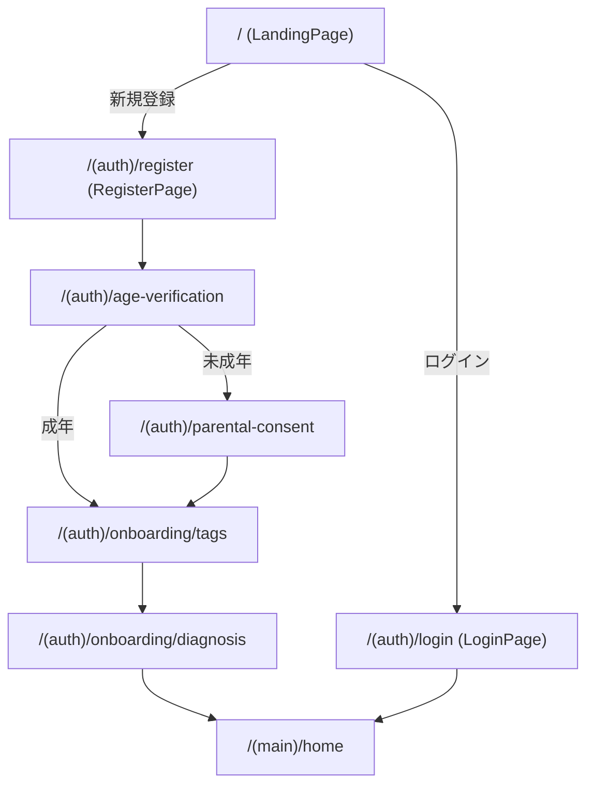
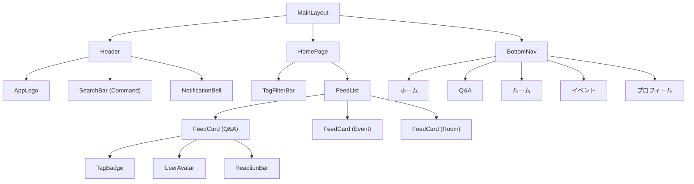
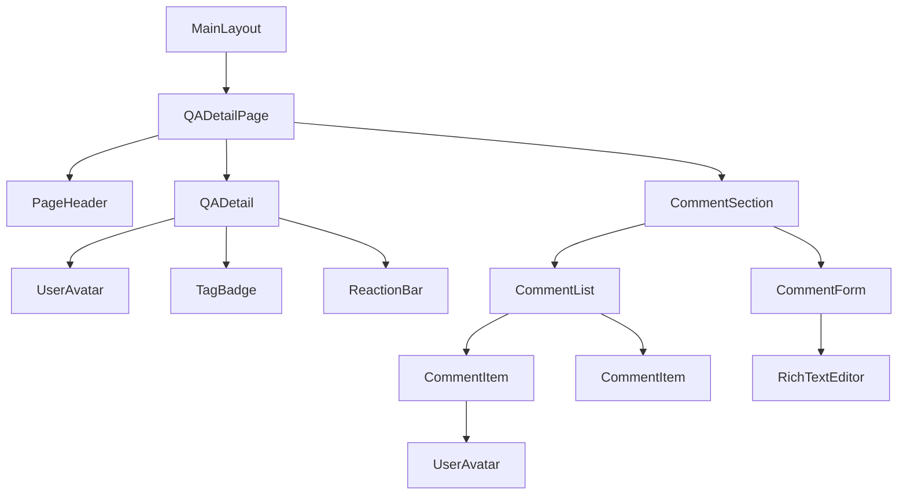
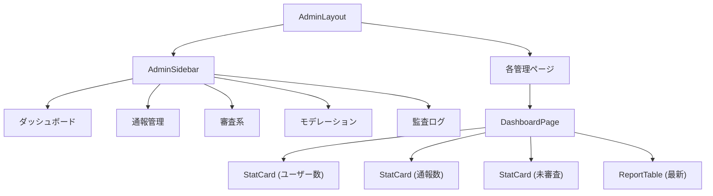

# フロントエンド コンポーネント設計書

## 1. App Router ルート構成

```
src/
├── app/
│   ├── layout.tsx                          # ルートレイアウト（フォント、ThemeProvider）
│   ├── page.tsx                            # LP / ログインページ
│   ├── globals.css
│   │
│   ├── (auth)/                             # 認証フローグループ（ヘッダーなし）
│   │   ├── layout.tsx                      # 認証レイアウト（中央寄せカード）
│   │   ├── login/
│   │   │   └── page.tsx                    # ログイン
│   │   ├── register/
│   │   │   └── page.tsx                    # 会員登録
│   │   ├── age-verification/
│   │   │   └── page.tsx                    # 年齢確認
│   │   ├── parental-consent/
│   │   │   └── page.tsx                    # 保護者同意
│   │   └── onboarding/
│   │       ├── tags/
│   │       │   └── page.tsx                # 興味タグ選択
│   │       └── diagnosis/
│   │           └── page.tsx                # 簡易診断
│   │
│   ├── (main)/                             # メインアプリグループ
│   │   ├── layout.tsx                      # メインレイアウト（ヘッダー + ボトムナビ）
│   │   ├── home/
│   │   │   └── page.tsx                    # ホーム / タグフィード
│   │   ├── communities/
│   │   │   └── page.tsx                    # おすすめコミュニティ一覧
│   │   ├── qa/
│   │   │   ├── page.tsx                    # Q&A 一覧
│   │   │   ├── [id]/
│   │   │   │   └── page.tsx                # Q&A 詳細
│   │   │   └── create/
│   │   │       └── page.tsx                # Q&A 作成
│   │   ├── rooms/
│   │   │   ├── page.tsx                    # ルーム一覧
│   │   │   ├── [id]/
│   │   │   │   ├── page.tsx                # ルーム詳細
│   │   │   │   └── profile/
│   │   │   │       └── page.tsx            # ルーム専用プロフィール編集
│   │   │   └── join/
│   │   │       └── page.tsx                # ルーム参加
│   │   ├── events/
│   │   │   ├── page.tsx                    # イベント一覧
│   │   │   ├── [id]/
│   │   │   │   └── page.tsx                # イベント詳細
│   │   │   └── create/
│   │   │       └── page.tsx                # イベント作成
│   │   ├── mentors/
│   │   │   ├── page.tsx                    # メンター一覧
│   │   │   ├── [id]/
│   │   │   │   └── page.tsx                # メンター詳細
│   │   │   └── booking/
│   │   │       └── [mentorId]/
│   │   │           └── page.tsx            # 予約ページ
│   │   ├── profile/
│   │   │   ├── page.tsx                    # 自分のプロフィール
│   │   │   └── edit/
│   │   │       └── page.tsx                # プロフィール編集
│   │   ├── ai-support/
│   │   │   └── page.tsx                    # AIチャットサポート（モック）
│   │   └── notifications/
│   │       └── page.tsx                    # 通知 / 履歴
│   │
│   ├── (admin)/                            # 管理者グループ
│   │   ├── layout.tsx                      # 管理者レイアウト（サイドバー）
│   │   ├── admin/
│   │   │   ├── page.tsx                    # ダッシュボード
│   │   │   ├── login/
│   │   │   │   └── page.tsx                # 管理者ログイン
│   │   │   ├── reports/
│   │   │   │   └── page.tsx                # 通報管理
│   │   │   ├── verifications/
│   │   │   │   └── page.tsx                # 年齢確認審査
│   │   │   ├── mentors/
│   │   │   │   └── page.tsx                # メンター審査
│   │   │   ├── rooms/
│   │   │   │   └── page.tsx                # ルーム承認
│   │   │   ├── events/
│   │   │   │   └── page.tsx                # イベント監視
│   │   │   ├── moderation/
│   │   │   │   └── page.tsx                # NGワード / モデレーション設定
│   │   │   └── audit-log/
│   │   │       └── page.tsx                # 監査ログ
│   │
│   └── api/                                # API Routes（必要最小限）
│       └── auth/
│           └── callback/
│               └── route.ts                # Supabase Auth コールバック
│
├── components/
│   ├── ui/                                 # shadcn/ui 生成コンポーネント（自動生成）
│   ├── layout/                             # レイアウト系
│   ├── features/                           # 機能別コンポーネント
│   └── shared/                             # 共通コンポーネント
│
├── lib/
│   ├── supabase/
│   │   ├── client.ts                       # ブラウザ用 Supabase クライアント
│   │   ├── server.ts                       # サーバー用 Supabase クライアント
│   │   └── middleware.ts                   # 認証ミドルウェアヘルパー
│   ├── actions/                            # Server Actions
│   │   ├── auth.ts
│   │   ├── qa.ts
│   │   ├── rooms.ts
│   │   ├── events.ts
│   │   ├── mentors.ts
│   │   ├── profile.ts
│   │   └── admin.ts
│   ├── utils.ts                            # ユーティリティ（cn 関数など）
│   └── constants.ts                        # 定数定義
│
├── hooks/
│   ├── use-auth.ts                         # 認証状態フック
│   ├── use-notifications.ts                # 通知フック
│   └── use-realtime.ts                     # Supabase Realtime フック
│
├── types/
│   └── index.ts                            # 型定義
│
└── middleware.ts                            # Next.js ミドルウェア（認証ガード）
```

---

## 2. レイアウト階層

### 2.1 ルートレイアウト — `app/layout.tsx`

```
RootLayout
├── <html>
│   ├── ThemeProvider（ダークモード対応）
│   ├── Toaster（トースト通知）
│   └── {children}
```

**責務**: フォント読み込み、メタデータ、ThemeProvider、Toaster のグローバル設定。サーバーコンポーネント。

### 2.2 認証レイアウト — `app/(auth)/layout.tsx`

```
AuthLayout
├── div.min-h-screen.flex.items-center.justify-center
│   ├── AppLogo
│   └── Card（children をラップ）
```

**責務**: 認証済みユーザーをホームにリダイレクト。中央寄せのカードUIを提供。

### 2.3 メインレイアウト — `app/(main)/layout.tsx`

```
MainLayout
├── AuthGuard（未認証 → /login リダイレクト）
├── Header
│   ├── AppLogo
│   ├── SearchTrigger
│   └── NotificationBell
├── main（children）
└── BottomNav（モバイル固定フッター）
    ├── ホーム
    ├── Q&A
    ├── ルーム
    ├── イベント
    └── プロフィール
```

**責務**: 認証ガード、共通ヘッダー、モバイルボトムナビゲーション。`AuthGuard` はクライアントコンポーネント。

### 2.4 管理者レイアウト — `app/(admin)/layout.tsx`

```
AdminLayout
├── AdminAuthGuard（管理者権限チェック）
├── div.flex
│   ├── AdminSidebar
│   │   ├── ダッシュボード
│   │   ├── 通報管理
│   │   ├── 審査系
│   │   ├── モデレーション
│   │   └── 監査ログ
│   └── main（children）
```

**責務**: 管理者認証ガード、サイドバーナビゲーション。デスクトップ前提レイアウト。

---

## 3. ページコンポーネント一覧

### 3.1 認証フロー

| ルート | ページコンポーネント | 種別 | 説明 |
|---|---|---|---|
| `/` | `LandingPage` | Server | LP。未認証→LP、認証済→/home リダイレクト |
| `/(auth)/login` | `LoginPage` | Client | メール/パスワードログイン、ソーシャルログイン |
| `/(auth)/register` | `RegisterPage` | Client | 会員登録フォーム |
| `/(auth)/age-verification` | `AgeVerificationPage` | Client | 生年月日入力による年齢確認 |
| `/(auth)/parental-consent` | `ParentalConsentPage` | Client | 保護者同意フォーム（未成年のみ） |
| `/(auth)/onboarding/tags` | `TagSelectionPage` | Client | 興味タグの複数選択 |
| `/(auth)/onboarding/diagnosis` | `DiagnosisPage` | Client | 簡易診断（ステッパーUI） |

### 3.2 メイン画面

| ルート | ページコンポーネント | 種別 | 説明 |
|---|---|---|---|
| `/(main)/home` | `HomePage` | Server | タグフィード。タグフィルターバー + カード一覧 |
| `/(main)/communities` | `CommunitiesPage` | Server | おすすめコミュニティ一覧 |
| `/(main)/qa` | `QAListPage` | Server | Q&A 一覧（検索・フィルター付き） |
| `/(main)/qa/[id]` | `QADetailPage` | Server | Q&A 詳細 + コメント + リアクション |
| `/(main)/qa/create` | `QACreatePage` | Client | Q&A 投稿フォーム |
| `/(main)/rooms` | `RoomListPage` | Server | ルーム一覧 |
| `/(main)/rooms/[id]` | `RoomDetailPage` | Server | ルーム詳細（投稿フィード） |
| `/(main)/rooms/[id]/profile` | `RoomProfileEditPage` | Client | ルーム専用プロフィール編集 |
| `/(main)/rooms/join` | `RoomJoinPage` | Client | ルーム参加申請 |
| `/(main)/events` | `EventListPage` | Server | イベント一覧 |
| `/(main)/events/[id]` | `EventDetailPage` | Server | イベント詳細 + 参加ボタン |
| `/(main)/events/create` | `EventCreatePage` | Client | イベント作成フォーム |
| `/(main)/mentors` | `MentorListPage` | Server | メンター一覧 |
| `/(main)/mentors/[id]` | `MentorDetailPage` | Server | メンター詳細 + レビュー |
| `/(main)/mentors/booking/[mentorId]` | `BookingPage` | Client | 予約スロット選択 + 予約確定 |
| `/(main)/profile` | `ProfilePage` | Server | 自分のプロフィール表示 |
| `/(main)/profile/edit` | `ProfileEditPage` | Client | プロフィール編集フォーム |
| `/(main)/ai-support` | `AISupportPage` | Client | AIチャットUI（モック） |
| `/(main)/notifications` | `NotificationsPage` | Server | 通知一覧 + 履歴 |

### 3.3 管理者画面

| ルート | ページコンポーネント | 種別 | 説明 |
|---|---|---|---|
| `/(admin)/admin` | `AdminDashboardPage` | Server | 統計サマリー |
| `/(admin)/admin/login` | `AdminLoginPage` | Client | 管理者ログイン |
| `/(admin)/admin/reports` | `ReportManagementPage` | Server | 通報一覧 + 対応 |
| `/(admin)/admin/verifications` | `VerificationReviewPage` | Server | 年齢確認審査キュー |
| `/(admin)/admin/mentors` | `MentorReviewPage` | Server | メンター申請審査 |
| `/(admin)/admin/rooms` | `RoomApprovalPage` | Server | ルーム作成承認 |
| `/(admin)/admin/events` | `EventMonitoringPage` | Server | イベント監視 |
| `/(admin)/admin/moderation` | `ModerationSettingsPage` | Client | NGワード管理、モデレーション設定 |
| `/(admin)/admin/audit-log` | `AuditLogPage` | Server | 監査ログ閲覧（検索・フィルター） |

---

## 4. 共通・再利用コンポーネント一覧

### 4.1 レイアウト系 — `components/layout/`

| コンポーネント | ファイル | 種別 | 説明 |
|---|---|---|---|
| `Header` | `header.tsx` | Client | アプリヘッダー。ロゴ、検索、通知ベル |
| `BottomNav` | `bottom-nav.tsx` | Client | モバイル固定フッターナビ（5タブ） |
| `AdminSidebar` | `admin-sidebar.tsx` | Client | 管理者サイドバーナビ |
| `AuthGuard` | `auth-guard.tsx` | Client | 認証状態チェック + リダイレクト |
| `AdminAuthGuard` | `admin-auth-guard.tsx` | Client | 管理者権限チェック + リダイレクト |
| `PageHeader` | `page-header.tsx` | Server | ページタイトル + パンくず |

### 4.2 共通 UI — `components/shared/`

| コンポーネント | ファイル | 種別 | 説明 |
|---|---|---|---|
| `AppLogo` | `app-logo.tsx` | Server | アプリロゴ表示 |
| `UserAvatar` | `user-avatar.tsx` | Server | ユーザーアバター（Avatar + フォールバック） |
| `TagBadge` | `tag-badge.tsx` | Server | 興味タグのバッジ表示 |
| `TagSelector` | `tag-selector.tsx` | Client | タグ複数選択UI（トグル式） |
| `TagFilterBar` | `tag-filter-bar.tsx` | Client | タグによる横スクロールフィルターバー |
| `SearchBar` | `search-bar.tsx` | Client | 検索入力（デバウンス付き） |
| `EmptyState` | `empty-state.tsx` | Server | データなし時の表示 |
| `LoadingSpinner` | `loading-spinner.tsx` | Server | ローディング表示 |
| `ErrorMessage` | `error-message.tsx` | Server | エラー表示 |
| `ConfirmDialog` | `confirm-dialog.tsx` | Client | 確認ダイアログ（AlertDialog ラッパー） |
| `NotificationBell` | `notification-bell.tsx` | Client | 通知アイコン + 未読バッジ |
| `ReactionBar` | `reaction-bar.tsx` | Client | リアクションボタン群 |
| `PaginationControl` | `pagination-control.tsx` | Client | ページネーション |
| `ImageUpload` | `image-upload.tsx` | Client | 画像アップロード（Supabase Storage 連携） |
| `RichTextEditor` | `rich-text-editor.tsx` | Client | テキストエディタ（最小限のマークダウン対応） |
| `DateTimePicker` | `date-time-picker.tsx` | Client | 日時選択（イベント作成用） |
| `StepIndicator` | `step-indicator.tsx` | Server | ステップインジケーター（オンボーディング用） |
| `StatusBadge` | `status-badge.tsx` | Server | ステータスバッジ（承認/保留/拒否） |

### 4.3 機能別コンポーネント — `components/features/`

| コンポーネント | ファイル | 種別 | 説明 |
|---|---|---|---|
| **認証** | | | |
| `LoginForm` | `auth/login-form.tsx` | Client | ログインフォーム（メール + パスワード） |
| `RegisterForm` | `auth/register-form.tsx` | Client | 会員登録フォーム |
| `SocialLoginButtons` | `auth/social-login-buttons.tsx` | Client | ソーシャルログインボタン群 |
| `AgeVerificationForm` | `auth/age-verification-form.tsx` | Client | 年齢確認フォーム |
| `ParentalConsentForm` | `auth/parental-consent-form.tsx` | Client | 保護者同意フォーム |
| **オンボーディング** | | | |
| `DiagnosisWizard` | `onboarding/diagnosis-wizard.tsx` | Client | 診断ステッパー（質問→結果） |
| `DiagnosisResult` | `onboarding/diagnosis-result.tsx` | Server | 診断結果カード |
| **フィード** | | | |
| `FeedCard` | `feed/feed-card.tsx` | Server | フィードカード（Q&A / イベント / ルーム共通） |
| `FeedList` | `feed/feed-list.tsx` | Server | フィードカードリスト |
| `CommunityCard` | `feed/community-card.tsx` | Server | コミュニティ推薦カード |
| **Q&A** | | | |
| `QACard` | `qa/qa-card.tsx` | Server | Q&A カード（一覧表示用） |
| `QADetail` | `qa/qa-detail.tsx` | Server | Q&A 詳細表示 |
| `QAForm` | `qa/qa-form.tsx` | Client | Q&A 投稿・編集フォーム |
| `CommentList` | `qa/comment-list.tsx` | Server | コメント一覧 |
| `CommentForm` | `qa/comment-form.tsx` | Client | コメント投稿フォーム |
| **ルーム** | | | |
| `RoomCard` | `rooms/room-card.tsx` | Server | ルームカード（一覧表示用） |
| `RoomHeader` | `rooms/room-header.tsx` | Server | ルーム詳細ヘッダー |
| `RoomPostFeed` | `rooms/room-post-feed.tsx` | Server | ルーム内投稿フィード |
| `RoomPostForm` | `rooms/room-post-form.tsx` | Client | ルーム内投稿フォーム |
| `RoomProfileForm` | `rooms/room-profile-form.tsx` | Client | ルーム専用プロフィール編集フォーム |
| `JoinRoomButton` | `rooms/join-room-button.tsx` | Client | ルーム参加ボタン |
| **イベント** | | | |
| `EventCard` | `events/event-card.tsx` | Server | イベントカード（一覧表示用） |
| `EventDetail` | `events/event-detail.tsx` | Server | イベント詳細表示 |
| `EventForm` | `events/event-form.tsx` | Client | イベント作成・編集フォーム |
| `JoinEventButton` | `events/join-event-button.tsx` | Client | イベント参加ボタン |
| **メンター** | | | |
| `MentorCard` | `mentors/mentor-card.tsx` | Server | メンターカード（一覧表示用） |
| `MentorDetail` | `mentors/mentor-detail.tsx` | Server | メンター詳細 + スキル・レビュー |
| `BookingCalendar` | `mentors/booking-calendar.tsx` | Client | 予約スロット選択カレンダー |
| `BookingConfirm` | `mentors/booking-confirm.tsx` | Client | 予約確認ダイアログ |
| **プロフィール** | | | |
| `ProfileDisplay` | `profile/profile-display.tsx` | Server | プロフィール表示 |
| `ProfileForm` | `profile/profile-form.tsx` | Client | プロフィール編集フォーム |
| `ActivityHistory` | `profile/activity-history.tsx` | Server | 活動履歴タブ |
| **AIサポート** | | | |
| `ChatWindow` | `ai-support/chat-window.tsx` | Client | チャットUI（メッセージ一覧 + 入力） |
| `ChatMessage` | `ai-support/chat-message.tsx` | Server | チャットメッセージバブル |
| `MockAIResponse` | `ai-support/mock-ai-response.tsx` | Client | モックAIレスポンス生成 |
| **管理者** | | | |
| `StatCard` | `admin/stat-card.tsx` | Server | ダッシュボード統計カード |
| `ReportTable` | `admin/report-table.tsx` | Client | 通報一覧テーブル（ソート・フィルター） |
| `ReviewQueue` | `admin/review-queue.tsx` | Client | 審査キュー（承認/拒否アクション） |
| `NGWordEditor` | `admin/ng-word-editor.tsx` | Client | NGワード編集UI |
| `AuditLogTable` | `admin/audit-log-table.tsx` | Client | 監査ログテーブル（検索・フィルター） |

---

## 5. shadcn/ui インストールコンポーネント

MVP で必要な shadcn/ui コンポーネントを以下にまとめる。

```bash
# 初期セットアップ
npx shadcn@latest init

# インストールするコンポーネント
npx shadcn@latest add \
  button \
  card \
  input \
  label \
  textarea \
  select \
  checkbox \
  radio-group \
  switch \
  dialog \
  alert-dialog \
  sheet \
  dropdown-menu \
  popover \
  tabs \
  badge \
  avatar \
  separator \
  skeleton \
  toast \
  form \
  table \
  pagination \
  calendar \
  command \
  scroll-area \
  tooltip
```

| コンポーネント | 主な用途 |
|---|---|
| `Button` | 全画面の操作ボタン |
| `Card` | フィードカード、プロフィールカード、統計カード |
| `Input` / `Label` / `Textarea` | フォーム全般 |
| `Select` | ドロップダウン選択 |
| `Checkbox` / `RadioGroup` / `Switch` | 設定、診断、同意 |
| `Dialog` / `AlertDialog` | モーダル、確認ダイアログ |
| `Sheet` | モバイルドロワー（メニュー、フィルター） |
| `DropdownMenu` | ユーザーメニュー、投稿の「...」メニュー |
| `Popover` | 通知ポップオーバー |
| `Tabs` | プロフィール内タブ、ルーム内タブ |
| `Badge` | タグ、ステータス |
| `Avatar` | ユーザーアバター |
| `Separator` | セクション区切り |
| `Skeleton` | ローディング状態 |
| `Toast` | 操作結果通知 |
| `Form` | react-hook-form + zod 統合フォーム |
| `Table` | 管理者テーブル（通報、監査ログ） |
| `Pagination` | 一覧ページのページネーション |
| `Calendar` | メンター予約カレンダー |
| `Command` | 検索パレット（タグ・ルーム検索） |
| `ScrollArea` | チャットウィンドウ、長いリスト |
| `Tooltip` | アイコンボタンの補足説明 |

---

## 6. コンポーネントツリー図（主要ユーザーフロー）

### 6.1 オンボーディングフロー



### 6.2 ホーム画面コンポーネントツリー



### 6.3 Q&A 詳細コンポーネントツリー



### 6.4 管理者画面コンポーネントツリー



---

## 7. 状態管理方針

### 7.1 Server Components vs Client Components の使い分け

| 区分 | 使用場面 | 例 |
|---|---|---|
| **Server Component**（デフォルト） | データ取得・表示のみのページ / コンポーネント | 一覧ページ、詳細ページ、カード、バッジ |
| **Client Component**（`"use client"`） | ユーザー操作・状態管理が必要 | フォーム、ボタン、ナビゲーション、リアルタイム |

### 7.2 原則

1. **ページコンポーネントは可能な限り Server Component にする**
   - データ取得をサーバー側で完結させ、初期表示を高速化
   - インタラクティブな部分だけを Client Component として切り出す

2. **クライアント状態は最小化する**
   - グローバル状態管理ライブラリ（Redux 等）は使用しない
   - 必要な状態は `useState` / `useReducer` でコンポーネントローカルに管理
   - 認証状態は `use-auth.ts` カスタムフックで Supabase Auth を参照

3. **URL を状態の源泉にする**
   - フィルター、検索、ソートは `searchParams` を使用
   - タブ選択も URL パラメーターで管理
   - これにより Server Component でのデータ取得が可能

### 7.3 状態の配置先

| 状態 | 管理方法 | 場所 |
|---|---|---|
| 認証情報 | Supabase Auth + `use-auth` フック | `hooks/use-auth.ts` |
| フォーム状態 | `react-hook-form` + `zod` | 各フォームコンポーネント内 |
| 一覧フィルター / 検索 | URL `searchParams` | Server Component で取得 |
| タブ選択 | URL `searchParams` | Server Component で取得 |
| モーダル開閉 | `useState` | 各 Client Component 内 |
| 通知未読数 | Supabase Realtime + `use-notifications` | `hooks/use-notifications.ts` |
| チャット履歴（AIモック） | `useState` | `ChatWindow` 内 |
| 楽観的更新（リアクション等） | `useOptimistic` | 各インタラクションコンポーネント |

---

## 8. データ取得パターン

### 8.1 読み取り — Server Components

```typescript
// app/(main)/qa/page.tsx — Server Component
import { createServerClient } from "@/lib/supabase/server";

export default async function QAListPage({
  searchParams,
}: {
  searchParams: Promise<{ tag?: string; page?: string }>;
}) {
  const { tag, page } = await searchParams;
  const supabase = await createServerClient();

  const { data: questions } = await supabase
    .from("questions")
    .select("*, author:profiles(*), tags(*)")
    .order("created_at", { ascending: false })
    .range(/* pagination */);

  return <QAList questions={questions} />;
}
```

### 8.2 書き込み — Server Actions

```typescript
// lib/actions/qa.ts
"use server";

import { createServerClient } from "@/lib/supabase/server";
import { revalidatePath } from "next/cache";
import { z } from "zod";

const createQuestionSchema = z.object({
  title: z.string().min(1).max(200),
  body: z.string().min(1).max(5000),
  tagIds: z.array(z.string()).min(1).max(5),
});

export async function createQuestion(formData: FormData) {
  const supabase = await createServerClient();
  const { data: { user } } = await supabase.auth.getUser();

  if (!user) throw new Error("Unauthorized");

  const parsed = createQuestionSchema.parse({
    title: formData.get("title"),
    body: formData.get("body"),
    tagIds: formData.getAll("tagIds"),
  });

  await supabase.from("questions").insert({
    title: parsed.title,
    body: parsed.body,
    author_id: user.id,
  });

  revalidatePath("/(main)/qa");
}
```

### 8.3 パターン一覧

| 操作 | 手法 | 再検証 |
|---|---|---|
| 一覧取得 | Server Component で `supabase.from().select()` | — |
| 詳細取得 | Server Component で `supabase.from().select().eq()` | — |
| 作成 | Server Action + `revalidatePath` | 一覧パスを再検証 |
| 更新 | Server Action + `revalidatePath` | 詳細パスを再検証 |
| 削除 | Server Action + `revalidatePath` | 一覧パスを再検証 |
| リアクション | Server Action + `useOptimistic` | 楽観的更新 + 再検証 |
| リアルタイム通知 | Client Component で Supabase Realtime | `use-notifications` フック |
| 画像アップロード | Client Component で `supabase.storage` | アップロード後にフォーム値更新 |
| 認証 | Client Component で `supabase.auth` | ミドルウェアでセッション管理 |

### 8.4 ローディング / エラー UI

各ルートセグメントに Next.js の規約ファイルを配置する。

```
app/(main)/qa/
├── page.tsx
├── loading.tsx      # Skeleton UI（カードのスケルトン一覧）
├── error.tsx        # ErrorMessage コンポーネント表示
└── not-found.tsx    # 404 表示
```

- `loading.tsx`: shadcn/ui の `Skeleton` を使用したスケルトン画面
- `error.tsx`: `"use client"` + エラーリカバリーボタン
- `not-found.tsx`: `EmptyState` コンポーネントで 404 表示

---

## 補足: ミドルウェア設計

`src/middleware.ts` で全ルートの認証ガードを行う。

```typescript
// src/middleware.ts
import { NextResponse } from "next/server";
import type { NextRequest } from "next/server";
import { updateSession } from "@/lib/supabase/middleware";

export async function middleware(request: NextRequest) {
  const response = await updateSession(request);
  const { pathname } = request.nextUrl;

  // 公開ルート
  const publicPaths = ["/", "/login", "/register"];
  if (publicPaths.some((p) => pathname.startsWith(p))) {
    return response;
  }

  // 管理者ルート → 管理者権限チェック
  if (pathname.startsWith("/admin")) {
    // セッションから role を確認
  }

  return response;
}

export const config = {
  matcher: ["/((?!_next/static|_next/image|favicon.ico).*)"],
};
```
