# データベース設計書

## 学生向け「挑戦・学び・相談」コミュニティプラットフォーム MVP

- 文書種別: データベース設計書
- データベース: Supabase (PostgreSQL)
- スキーマ: `public`（アプリデータ）/ `auth`（Supabase Auth 管理）
- 作成日: 2026-03-24

---

## 1. ER 図

```mermaid
erDiagram
    %% ── 認証・ユーザー ──
    users ||--o| verification : "has"
    users ||--o| guardian_consent : "has"
    users ||--o| mentor_profile : "has"
    users ||--o{ diagnosis_result : "takes"
    users ||--o{ user_tags : "selects"
    tags  ||--o{ user_tags : "selected_by"

    %% ── コミュニティ・ルーム ──
    communities ||--o{ rooms : "contains"
    communities ||--o{ community_tags : "tagged_with"
    tags ||--o{ community_tags : "tags"
    rooms ||--o{ room_memberships : "has"
    rooms ||--o{ room_profiles : "has"
    users ||--o{ room_memberships : "joins"
    users ||--o{ room_profiles : "creates"

    %% ── 投稿・コメント・リアクション ──
    users ||--o{ posts : "authors"
    rooms ||--o{ posts : "contains"
    posts ||--o{ comments : "has"
    users ||--o{ comments : "writes"
    users ||--o{ reactions : "gives"

    %% ── イベント ──
    users ||--o{ events : "creates"
    rooms ||--o{ events : "hosts"
    events ||--o{ event_participations : "has"
    users ||--o{ event_participations : "joins"

    %% ── メンター相談 ──
    mentor_profile ||--o{ booking_slots : "offers"
    booking_slots ||--o| consultation_bookings : "booked_as"
    users ||--o{ consultation_bookings : "requests"

    %% ── モデレーション ──
    users ||--o{ reports : "files"
    users ||--o{ ai_profile_drafts : "generates"
    users ||--o{ notifications : "receives"
    users ||--o{ audit_logs : "triggers"

    %% ── エンティティ定義 ──
    users {
        uuid id PK
        text display_name
        text email
        age_group_enum age_group
        user_role_enum role
        verification_status_enum verification_status
        consent_status_enum consent_status
        text bio
        timestamptz created_at
        timestamptz updated_at
    }

    verification {
        uuid id PK
        uuid user_id FK
        verification_status_enum status
        timestamptz submitted_at
        timestamptz reviewed_at
        timestamptz created_at
        timestamptz updated_at
    }

    guardian_consent {
        uuid id PK
        uuid user_id FK
        consent_status_enum status
        timestamptz submitted_at
        timestamptz approved_at
        timestamptz created_at
        timestamptz updated_at
    }

    tags {
        uuid id PK
        text name
        tag_category_enum category
    }

    user_tags {
        uuid id PK
        uuid user_id FK
        uuid tag_id FK
    }

    diagnosis_result {
        uuid id PK
        uuid user_id FK
        text summary
        interest_level_enum interest_level
        goal_type_enum goal_type
        timestamptz created_at
    }

    communities {
        uuid id PK
        text name
        text description
        community_visibility_enum visibility
        uuid created_by FK
        timestamptz created_at
        timestamptz updated_at
    }

    community_tags {
        uuid id PK
        uuid community_id FK
        uuid tag_id FK
    }

    rooms {
        uuid id PK
        uuid community_id FK
        text title
        text description
        age_policy_enum age_policy
        boolean approval_required
        uuid created_by FK
        timestamptz created_at
        timestamptz updated_at
    }

    room_memberships {
        uuid id PK
        uuid room_id FK
        uuid user_id FK
        room_membership_status_enum status
        timestamptz created_at
        timestamptz updated_at
    }

    room_profiles {
        uuid id PK
        uuid room_id FK
        uuid user_id FK
        text nickname
        text icon_url
        text intro
        timestamptz created_at
        timestamptz updated_at
    }

    posts {
        uuid id PK
        uuid author_id FK
        uuid room_id FK
        post_type_enum type
        text title
        text body
        content_status_enum status
        timestamptz created_at
        timestamptz updated_at
    }

    comments {
        uuid id PK
        uuid post_id FK
        uuid author_id FK
        text body
        content_status_enum status
        timestamptz created_at
        timestamptz updated_at
    }

    reactions {
        uuid id PK
        uuid user_id FK
        target_type_enum target_type
        uuid target_id
        reaction_type_enum reaction_type
        timestamptz created_at
    }

    events {
        uuid id PK
        uuid creator_id FK
        uuid room_id FK
        text title
        text description
        timestamptz start_at
        event_visibility_enum visibility
        event_status_enum status
        timestamptz created_at
        timestamptz updated_at
    }

    event_participations {
        uuid id PK
        uuid event_id FK
        uuid user_id FK
        participation_status_enum status
        timestamptz created_at
        timestamptz updated_at
    }

    mentor_profile {
        uuid id PK
        uuid user_id FK
        mentor_status_enum status
        text expertise
        text target_audience
        timestamptz created_at
        timestamptz updated_at
    }

    booking_slots {
        uuid id PK
        uuid mentor_user_id FK
        timestamptz start_at
        timestamptz end_at
        slot_status_enum status
        timestamptz created_at
        timestamptz updated_at
    }

    consultation_bookings {
        uuid id PK
        uuid slot_id FK
        uuid mentor_user_id FK
        uuid requester_user_id FK
        text topic
        booking_status_enum status
        timestamptz created_at
        timestamptz updated_at
    }

    reports {
        uuid id PK
        uuid reporter_id FK
        target_type_enum target_type
        uuid target_id
        text reason
        report_status_enum status
        timestamptz created_at
        timestamptz updated_at
    }

    moderation_cases {
        uuid id PK
        target_type_enum target_type
        uuid target_id
        text ai_label
        review_status_enum review_status
        moderation_action_enum action
        timestamptz created_at
        timestamptz updated_at
    }

    ai_profile_drafts {
        uuid id PK
        uuid user_id FK
        draft_type_enum draft_type
        jsonb content
        draft_status_enum status
        timestamptz created_at
        timestamptz updated_at
    }

    notifications {
        uuid id PK
        uuid user_id FK
        notification_type_enum type
        text title
        text body
        jsonb metadata
        boolean is_read
        timestamptz created_at
    }

    audit_logs {
        uuid id PK
        uuid actor_id FK
        text action
        text target_type
        uuid target_id
        jsonb details
        text ip_address
        timestamptz created_at
    }
```



---

## 2. ENUM 型定義

```sql
-- ユーザー関連
CREATE TYPE public.user_role AS ENUM (
  'guest', 'user', 'verified', 'minor', 'mentor', 'admin'
);

CREATE TYPE public.age_group AS ENUM (
  'under_13', '13_15', '16_17', '18_plus'
);

CREATE TYPE public.verification_status AS ENUM (
  'unverified', 'pending', 'approved', 'rejected'
);

CREATE TYPE public.consent_status AS ENUM (
  'not_required', 'pending', 'approved', 'rejected'
);

-- タグ関連
CREATE TYPE public.tag_category AS ENUM (
  'interest', 'skill', 'goal', 'field'
);

-- 診断関連
CREATE TYPE public.interest_level AS ENUM (
  'beginner', 'intermediate', 'advanced'
);

CREATE TYPE public.goal_type AS ENUM (
  'learn', 'create', 'connect', 'career', 'explore'
);

-- コミュニティ・ルーム関連
CREATE TYPE public.community_visibility AS ENUM (
  'public', 'unlisted', 'private'
);

CREATE TYPE public.age_policy AS ENUM (
  'all_ages', 'adults_only', 'minors_allowed'
);

CREATE TYPE public.room_membership_status AS ENUM (
  'pending', 'approved', 'rejected', 'banned'
);

-- 投稿関連
CREATE TYPE public.post_type AS ENUM (
  'question', 'discussion', 'announcement', 'report'
);

CREATE TYPE public.content_status AS ENUM (
  'draft', 'published', 'hidden', 'deleted'
);

-- リアクション関連
CREATE TYPE public.target_type AS ENUM (
  'post', 'comment', 'event'
);

CREATE TYPE public.reaction_type AS ENUM (
  'like', 'helpful', 'interesting', 'support'
);

-- イベント関連
CREATE TYPE public.event_visibility AS ENUM (
  'public', 'room_only', 'invite_only'
);

CREATE TYPE public.event_status AS ENUM (
  'draft', 'published', 'cancelled', 'completed'
);

CREATE TYPE public.participation_status AS ENUM (
  'registered', 'attended', 'cancelled', 'no_show'
);

-- メンター関連
CREATE TYPE public.mentor_status AS ENUM (
  'pending', 'approved', 'suspended', 'rejected'
);

CREATE TYPE public.slot_status AS ENUM (
  'available', 'booked', 'cancelled', 'completed'
);

CREATE TYPE public.booking_status AS ENUM (
  'pending', 'confirmed', 'cancelled_by_requester', 'cancelled_by_mentor', 'completed', 'no_show'
);

-- モデレーション関連
CREATE TYPE public.report_status AS ENUM (
  'open', 'reviewing', 'resolved', 'dismissed'
);

CREATE TYPE public.review_status AS ENUM (
  'pending', 'reviewed', 'escalated'
);

CREATE TYPE public.moderation_action AS ENUM (
  'none', 'warn', 'hide', 'delete', 'suspend_user', 'ban_user'
);

-- AI プロフィール関連
CREATE TYPE public.draft_type AS ENUM (
  'bio', 'room_intro', 'mentor_expertise'
);

CREATE TYPE public.draft_status AS ENUM (
  'generating', 'generated', 'accepted', 'rejected'
);

-- 通知関連
CREATE TYPE public.notification_type AS ENUM (
  'system', 'mention', 'reply', 'event_reminder', 'booking_update', 'moderation', 'welcome'
);
```

---

## 3. テーブル DDL

### 3.1 users（ユーザー）

`auth.users` は Supabase Auth が管理する。`public.users` はアプリ固有のプロフィール情報を保持し、`auth.users.id` と 1:1 で紐づく。

```sql
CREATE TABLE public.users (
  id               uuid PRIMARY KEY REFERENCES auth.users(id) ON DELETE CASCADE,
  display_name     text NOT NULL DEFAULT '',
  email            text NOT NULL,
  age_group        public.age_group,
  role             public.user_role NOT NULL DEFAULT 'user',
  verification_status public.verification_status NOT NULL DEFAULT 'unverified',
  consent_status   public.consent_status NOT NULL DEFAULT 'not_required',
  bio              text DEFAULT '',
  avatar_url       text,
  created_at       timestamptz NOT NULL DEFAULT now(),
  updated_at       timestamptz NOT NULL DEFAULT now(),

  CONSTRAINT users_email_unique UNIQUE (email)
);

COMMENT ON TABLE public.users IS 'アプリケーション用ユーザープロフィール。auth.users と 1:1。';
```

### 3.2 verifications（年齢確認）

```sql
CREATE TABLE public.verifications (
  id            uuid PRIMARY KEY DEFAULT gen_random_uuid(),
  user_id       uuid NOT NULL REFERENCES public.users(id) ON DELETE CASCADE,
  status        public.verification_status NOT NULL DEFAULT 'pending',
  document_url  text,
  submitted_at  timestamptz NOT NULL DEFAULT now(),
  reviewed_at   timestamptz,
  reviewer_id   uuid REFERENCES public.users(id),
  reject_reason text,
  created_at    timestamptz NOT NULL DEFAULT now(),
  updated_at    timestamptz NOT NULL DEFAULT now(),

  CONSTRAINT verifications_user_unique UNIQUE (user_id)
);

COMMENT ON TABLE public.verifications IS '年齢確認（本人確認）申請。ユーザーにつき 1 レコード。';
```

### 3.3 guardian_consents（保護者同意）

```sql
CREATE TABLE public.guardian_consents (
  id                uuid PRIMARY KEY DEFAULT gen_random_uuid(),
  user_id           uuid NOT NULL REFERENCES public.users(id) ON DELETE CASCADE,
  status            public.consent_status NOT NULL DEFAULT 'pending',
  guardian_email     text,
  submitted_at      timestamptz NOT NULL DEFAULT now(),
  approved_at       timestamptz,
  created_at        timestamptz NOT NULL DEFAULT now(),
  updated_at        timestamptz NOT NULL DEFAULT now(),

  CONSTRAINT guardian_consents_user_unique UNIQUE (user_id)
);

COMMENT ON TABLE public.guardian_consents IS '未成年ユーザーの保護者同意レコード。';
```

### 3.4 tags（タグ）

```sql
CREATE TABLE public.tags (
  id         uuid PRIMARY KEY DEFAULT gen_random_uuid(),
  name       text NOT NULL,
  category   public.tag_category NOT NULL,
  created_at timestamptz NOT NULL DEFAULT now(),

  CONSTRAINT tags_name_category_unique UNIQUE (name, category)
);

COMMENT ON TABLE public.tags IS '興味・スキル・目的タグのマスター。';
```

### 3.5 user_tags（ユーザー × タグ中間テーブル）

```sql
CREATE TABLE public.user_tags (
  id         uuid PRIMARY KEY DEFAULT gen_random_uuid(),
  user_id    uuid NOT NULL REFERENCES public.users(id) ON DELETE CASCADE,
  tag_id     uuid NOT NULL REFERENCES public.tags(id) ON DELETE CASCADE,
  created_at timestamptz NOT NULL DEFAULT now(),

  CONSTRAINT user_tags_unique UNIQUE (user_id, tag_id)
);

COMMENT ON TABLE public.user_tags IS 'ユーザーが選択した興味タグ。';
```

### 3.6 diagnosis_results（診断結果）

```sql
CREATE TABLE public.diagnosis_results (
  id             uuid PRIMARY KEY DEFAULT gen_random_uuid(),
  user_id        uuid NOT NULL REFERENCES public.users(id) ON DELETE CASCADE,
  summary        text NOT NULL DEFAULT '',
  interest_level public.interest_level NOT NULL,
  goal_type      public.goal_type NOT NULL,
  raw_answers    jsonb,
  created_at     timestamptz NOT NULL DEFAULT now()
);

COMMENT ON TABLE public.diagnosis_results IS 'オンボーディング簡易診断の結果。複数回実施可。';
```

### 3.7 communities（コミュニティ）

```sql
CREATE TABLE public.communities (
  id          uuid PRIMARY KEY DEFAULT gen_random_uuid(),
  name        text NOT NULL,
  description text DEFAULT '',
  visibility  public.community_visibility NOT NULL DEFAULT 'public',
  created_by  uuid NOT NULL REFERENCES public.users(id),
  created_at  timestamptz NOT NULL DEFAULT now(),
  updated_at  timestamptz NOT NULL DEFAULT now(),

  CONSTRAINT communities_name_unique UNIQUE (name)
);

COMMENT ON TABLE public.communities IS 'コミュニティ（トップレベルのグループ）。';
```

### 3.8 community_tags（コミュニティ × タグ中間テーブル）

```sql
CREATE TABLE public.community_tags (
  id            uuid PRIMARY KEY DEFAULT gen_random_uuid(),
  community_id  uuid NOT NULL REFERENCES public.communities(id) ON DELETE CASCADE,
  tag_id        uuid NOT NULL REFERENCES public.tags(id) ON DELETE CASCADE,
  created_at    timestamptz NOT NULL DEFAULT now(),

  CONSTRAINT community_tags_unique UNIQUE (community_id, tag_id)
);

COMMENT ON TABLE public.community_tags IS 'コミュニティに紐づくタグ。おすすめマッチングに使用。';
```

### 3.9 rooms（ルーム）

```sql
CREATE TABLE public.rooms (
  id                uuid PRIMARY KEY DEFAULT gen_random_uuid(),
  community_id      uuid NOT NULL REFERENCES public.communities(id) ON DELETE CASCADE,
  title             text NOT NULL,
  description       text DEFAULT '',
  age_policy        public.age_policy NOT NULL DEFAULT 'all_ages',
  approval_required boolean NOT NULL DEFAULT false,
  created_by        uuid NOT NULL REFERENCES public.users(id),
  created_at        timestamptz NOT NULL DEFAULT now(),
  updated_at        timestamptz NOT NULL DEFAULT now()
);

COMMENT ON TABLE public.rooms IS 'コミュニティ内のルーム。年齢ポリシーと承認制を個別に設定可能。';
```

### 3.10 room_memberships（ルーム参加）

```sql
CREATE TABLE public.room_memberships (
  id         uuid PRIMARY KEY DEFAULT gen_random_uuid(),
  room_id    uuid NOT NULL REFERENCES public.rooms(id) ON DELETE CASCADE,
  user_id    uuid NOT NULL REFERENCES public.users(id) ON DELETE CASCADE,
  status     public.room_membership_status NOT NULL DEFAULT 'pending',
  created_at timestamptz NOT NULL DEFAULT now(),
  updated_at timestamptz NOT NULL DEFAULT now(),

  CONSTRAINT room_memberships_unique UNIQUE (room_id, user_id)
);

COMMENT ON TABLE public.room_memberships IS 'ルームへの参加ステータス。';
```

### 3.11 room_profiles（ルーム専用プロフィール）

```sql
CREATE TABLE public.room_profiles (
  id         uuid PRIMARY KEY DEFAULT gen_random_uuid(),
  room_id    uuid NOT NULL REFERENCES public.rooms(id) ON DELETE CASCADE,
  user_id    uuid NOT NULL REFERENCES public.users(id) ON DELETE CASCADE,
  nickname   text NOT NULL DEFAULT '',
  icon_url   text,
  intro      text DEFAULT '',
  created_at timestamptz NOT NULL DEFAULT now(),
  updated_at timestamptz NOT NULL DEFAULT now(),

  CONSTRAINT room_profiles_unique UNIQUE (room_id, user_id)
);

COMMENT ON TABLE public.room_profiles IS 'ルームごとに設定できる専用プロフィール。';
```

### 3.12 posts（投稿）

```sql
CREATE TABLE public.posts (
  id         uuid PRIMARY KEY DEFAULT gen_random_uuid(),
  author_id  uuid NOT NULL REFERENCES public.users(id),
  room_id    uuid REFERENCES public.rooms(id) ON DELETE SET NULL,
  type       public.post_type NOT NULL DEFAULT 'question',
  title      text NOT NULL,
  body       text NOT NULL DEFAULT '',
  status     public.content_status NOT NULL DEFAULT 'published',
  created_at timestamptz NOT NULL DEFAULT now(),
  updated_at timestamptz NOT NULL DEFAULT now(),

  CONSTRAINT posts_title_not_empty CHECK (char_length(title) > 0)
);

COMMENT ON TABLE public.posts IS '公開 Q&A やルーム内の投稿。room_id が NULL の場合はグローバル Q&A。';
```

### 3.13 comments（コメント）

```sql
CREATE TABLE public.comments (
  id         uuid PRIMARY KEY DEFAULT gen_random_uuid(),
  post_id    uuid NOT NULL REFERENCES public.posts(id) ON DELETE CASCADE,
  author_id  uuid NOT NULL REFERENCES public.users(id),
  body       text NOT NULL,
  status     public.content_status NOT NULL DEFAULT 'published',
  parent_id  uuid REFERENCES public.comments(id) ON DELETE CASCADE,
  created_at timestamptz NOT NULL DEFAULT now(),
  updated_at timestamptz NOT NULL DEFAULT now(),

  CONSTRAINT comments_body_not_empty CHECK (char_length(body) > 0)
);

COMMENT ON TABLE public.comments IS '投稿へのコメント。parent_id でスレッド構造を表現。';
```

### 3.14 reactions（リアクション）

```sql
CREATE TABLE public.reactions (
  id            uuid PRIMARY KEY DEFAULT gen_random_uuid(),
  user_id       uuid NOT NULL REFERENCES public.users(id) ON DELETE CASCADE,
  target_type   public.target_type NOT NULL,
  target_id     uuid NOT NULL,
  reaction_type public.reaction_type NOT NULL DEFAULT 'like',
  created_at    timestamptz NOT NULL DEFAULT now(),

  CONSTRAINT reactions_unique UNIQUE (user_id, target_type, target_id, reaction_type)
);

COMMENT ON TABLE public.reactions IS 'ポリモーフィックなリアクション。target_type + target_id で対象を特定。';
```

### 3.15 events（イベント）

```sql
CREATE TABLE public.events (
  id          uuid PRIMARY KEY DEFAULT gen_random_uuid(),
  creator_id  uuid NOT NULL REFERENCES public.users(id),
  room_id     uuid REFERENCES public.rooms(id) ON DELETE SET NULL,
  title       text NOT NULL,
  description text DEFAULT '',
  start_at    timestamptz NOT NULL,
  end_at      timestamptz,
  visibility  public.event_visibility NOT NULL DEFAULT 'public',
  status      public.event_status NOT NULL DEFAULT 'draft',
  max_participants integer,
  created_at  timestamptz NOT NULL DEFAULT now(),
  updated_at  timestamptz NOT NULL DEFAULT now(),

  CONSTRAINT events_title_not_empty CHECK (char_length(title) > 0),
  CONSTRAINT events_time_range CHECK (end_at IS NULL OR end_at > start_at)
);

COMMENT ON TABLE public.events IS 'イベント。room_id が NULL の場合はグローバルイベント。';
```

### 3.16 event_participations（イベント参加）

```sql
CREATE TABLE public.event_participations (
  id         uuid PRIMARY KEY DEFAULT gen_random_uuid(),
  event_id   uuid NOT NULL REFERENCES public.events(id) ON DELETE CASCADE,
  user_id    uuid NOT NULL REFERENCES public.users(id) ON DELETE CASCADE,
  status     public.participation_status NOT NULL DEFAULT 'registered',
  created_at timestamptz NOT NULL DEFAULT now(),
  updated_at timestamptz NOT NULL DEFAULT now(),

  CONSTRAINT event_participations_unique UNIQUE (event_id, user_id)
);

COMMENT ON TABLE public.event_participations IS 'イベントへの参加登録。';
```

### 3.17 mentor_profiles（メンタープロフィール）

```sql
CREATE TABLE public.mentor_profiles (
  id              uuid PRIMARY KEY DEFAULT gen_random_uuid(),
  user_id         uuid NOT NULL REFERENCES public.users(id) ON DELETE CASCADE,
  status          public.mentor_status NOT NULL DEFAULT 'pending',
  expertise       text NOT NULL DEFAULT '',
  target_audience text DEFAULT '',
  created_at      timestamptz NOT NULL DEFAULT now(),
  updated_at      timestamptz NOT NULL DEFAULT now(),

  CONSTRAINT mentor_profiles_user_unique UNIQUE (user_id)
);

COMMENT ON TABLE public.mentor_profiles IS 'メンター審査申請と承認後のプロフィール。';
```

### 3.18 booking_slots（予約枠）

```sql
CREATE TABLE public.booking_slots (
  id              uuid PRIMARY KEY DEFAULT gen_random_uuid(),
  mentor_user_id  uuid NOT NULL REFERENCES public.users(id) ON DELETE CASCADE,
  start_at        timestamptz NOT NULL,
  end_at          timestamptz NOT NULL,
  status          public.slot_status NOT NULL DEFAULT 'available',
  created_at      timestamptz NOT NULL DEFAULT now(),
  updated_at      timestamptz NOT NULL DEFAULT now(),

  CONSTRAINT booking_slots_time_range CHECK (end_at > start_at),
  CONSTRAINT booking_slots_no_overlap EXCLUDE USING gist (
    mentor_user_id WITH =,
    tstzrange(start_at, end_at) WITH &&
  ) WHERE (status = 'available')
);

COMMENT ON TABLE public.booking_slots IS 'メンターが公開する予約枠。重複排除制約付き。';
```

### 3.19 consultation_bookings（相談予約）

```sql
CREATE TABLE public.consultation_bookings (
  id                uuid PRIMARY KEY DEFAULT gen_random_uuid(),
  slot_id           uuid NOT NULL REFERENCES public.booking_slots(id),
  mentor_user_id    uuid NOT NULL REFERENCES public.users(id),
  requester_user_id uuid NOT NULL REFERENCES public.users(id),
  topic             text NOT NULL DEFAULT '',
  status            public.booking_status NOT NULL DEFAULT 'pending',
  notes             text DEFAULT '',
  created_at        timestamptz NOT NULL DEFAULT now(),
  updated_at        timestamptz NOT NULL DEFAULT now(),

  CONSTRAINT consultation_bookings_slot_unique UNIQUE (slot_id),
  CONSTRAINT consultation_bookings_different_users CHECK (mentor_user_id <> requester_user_id)
);

COMMENT ON TABLE public.consultation_bookings IS '予約制相談の申込。1 スロットにつき 1 予約。';
```

### 3.20 reports（通報）

```sql
CREATE TABLE public.reports (
  id          uuid PRIMARY KEY DEFAULT gen_random_uuid(),
  reporter_id uuid NOT NULL REFERENCES public.users(id),
  target_type public.target_type NOT NULL,
  target_id   uuid NOT NULL,
  reason      text NOT NULL,
  status      public.report_status NOT NULL DEFAULT 'open',
  resolved_by uuid REFERENCES public.users(id),
  resolved_at timestamptz,
  created_at  timestamptz NOT NULL DEFAULT now(),
  updated_at  timestamptz NOT NULL DEFAULT now(),

  CONSTRAINT reports_reason_not_empty CHECK (char_length(reason) > 0)
);

COMMENT ON TABLE public.reports IS 'ユーザーからの通報。';
```

### 3.21 moderation_cases（モデレーションケース）

```sql
CREATE TABLE public.moderation_cases (
  id            uuid PRIMARY KEY DEFAULT gen_random_uuid(),
  target_type   public.target_type NOT NULL,
  target_id     uuid NOT NULL,
  ai_label      text,
  ai_confidence real,
  review_status public.review_status NOT NULL DEFAULT 'pending',
  action        public.moderation_action NOT NULL DEFAULT 'none',
  reviewer_id   uuid REFERENCES public.users(id),
  reviewed_at   timestamptz,
  notes         text DEFAULT '',
  created_at    timestamptz NOT NULL DEFAULT now(),
  updated_at    timestamptz NOT NULL DEFAULT now()
);

COMMENT ON TABLE public.moderation_cases IS 'AI 検知または通報から生成されるモデレーションケース。';
```

### 3.22 ai_profile_drafts（AI プロフィール下書き）

```sql
CREATE TABLE public.ai_profile_drafts (
  id         uuid PRIMARY KEY DEFAULT gen_random_uuid(),
  user_id    uuid NOT NULL REFERENCES public.users(id) ON DELETE CASCADE,
  draft_type public.draft_type NOT NULL,
  content    jsonb NOT NULL DEFAULT '{}',
  status     public.draft_status NOT NULL DEFAULT 'generating',
  created_at timestamptz NOT NULL DEFAULT now(),
  updated_at timestamptz NOT NULL DEFAULT now()
);

COMMENT ON TABLE public.ai_profile_drafts IS 'AI が生成したプロフィール下書き。';
```

### 3.23 notifications（通知）

```sql
CREATE TABLE public.notifications (
  id         uuid PRIMARY KEY DEFAULT gen_random_uuid(),
  user_id    uuid NOT NULL REFERENCES public.users(id) ON DELETE CASCADE,
  type       public.notification_type NOT NULL,
  title      text NOT NULL,
  body       text DEFAULT '',
  metadata   jsonb DEFAULT '{}',
  is_read    boolean NOT NULL DEFAULT false,
  created_at timestamptz NOT NULL DEFAULT now()
);

COMMENT ON TABLE public.notifications IS 'ユーザーへの通知。';
```

### 3.24 audit_logs（監査ログ）

```sql
CREATE TABLE public.audit_logs (
  id          uuid PRIMARY KEY DEFAULT gen_random_uuid(),
  actor_id    uuid REFERENCES public.users(id),
  action      text NOT NULL,
  target_type text NOT NULL,
  target_id   uuid,
  details     jsonb DEFAULT '{}',
  ip_address  inet,
  user_agent  text,
  created_at  timestamptz NOT NULL DEFAULT now()
);

COMMENT ON TABLE public.audit_logs IS '全操作の監査ログ。改ざん防止のため UPDATE/DELETE 不可ポリシーを適用。';
```

---

## 4. updated_at 自動更新トリガー

すべての `updated_at` カラムを持つテーブルに対して、自動更新トリガーを設定する。

```sql
-- 汎用 updated_at トリガー関数
CREATE OR REPLACE FUNCTION public.handle_updated_at()
RETURNS trigger AS $$
BEGIN
  NEW.updated_at = now();
  RETURN NEW;
END;
$$ LANGUAGE plpgsql;

-- 各テーブルにトリガーを適用
DO $$
DECLARE
  t text;
BEGIN
  FOREACH t IN ARRAY ARRAY[
    'users', 'verifications', 'guardian_consents',
    'communities', 'rooms', 'room_memberships', 'room_profiles',
    'posts', 'comments', 'events', 'event_participations',
    'mentor_profiles', 'booking_slots', 'consultation_bookings',
    'reports', 'moderation_cases', 'ai_profile_drafts'
  ]
  LOOP
    EXECUTE format(
      'CREATE TRIGGER set_updated_at BEFORE UPDATE ON public.%I
       FOR EACH ROW EXECUTE FUNCTION public.handle_updated_at()',
      t
    );
  END LOOP;
END;
$$;
```

---

## 5. インデックス

パフォーマンス観点で重要なインデックスを以下に定義する。主キーと UNIQUE 制約に含まれるカラムは PostgreSQL が自動的にインデックスを作成するため省略。

```sql
-- ユーザー検索
CREATE INDEX idx_users_role ON public.users(role);
CREATE INDEX idx_users_verification_status ON public.users(verification_status);

-- 年齢確認・保護者同意
CREATE INDEX idx_verifications_status ON public.verifications(status);
CREATE INDEX idx_guardian_consents_status ON public.guardian_consents(status);

-- タグ検索
CREATE INDEX idx_tags_category ON public.tags(category);
CREATE INDEX idx_user_tags_user_id ON public.user_tags(user_id);
CREATE INDEX idx_user_tags_tag_id ON public.user_tags(tag_id);
CREATE INDEX idx_community_tags_community_id ON public.community_tags(community_id);
CREATE INDEX idx_community_tags_tag_id ON public.community_tags(tag_id);

-- 診断結果
CREATE INDEX idx_diagnosis_results_user_id ON public.diagnosis_results(user_id);

-- コミュニティ・ルーム
CREATE INDEX idx_communities_visibility ON public.communities(visibility);
CREATE INDEX idx_rooms_community_id ON public.rooms(community_id);
CREATE INDEX idx_rooms_age_policy ON public.rooms(age_policy);

-- ルーム参加
CREATE INDEX idx_room_memberships_user_id ON public.room_memberships(user_id);
CREATE INDEX idx_room_memberships_status ON public.room_memberships(room_id, status);

-- 投稿フィード（新着順）
CREATE INDEX idx_posts_room_id_created ON public.posts(room_id, created_at DESC)
  WHERE status = 'published';
CREATE INDEX idx_posts_author_id ON public.posts(author_id);
CREATE INDEX idx_posts_type ON public.posts(type)
  WHERE status = 'published';

-- コメント
CREATE INDEX idx_comments_post_id ON public.comments(post_id, created_at ASC);
CREATE INDEX idx_comments_author_id ON public.comments(author_id);

-- リアクション集計
CREATE INDEX idx_reactions_target ON public.reactions(target_type, target_id);

-- イベント
CREATE INDEX idx_events_room_id ON public.events(room_id);
CREATE INDEX idx_events_start_at ON public.events(start_at)
  WHERE status = 'published';
CREATE INDEX idx_events_creator_id ON public.events(creator_id);

-- イベント参加
CREATE INDEX idx_event_participations_user_id ON public.event_participations(user_id);

-- メンター
CREATE INDEX idx_mentor_profiles_status ON public.mentor_profiles(status);

-- 予約枠（空き枠検索）
CREATE INDEX idx_booking_slots_mentor ON public.booking_slots(mentor_user_id, start_at)
  WHERE status = 'available';

-- 相談予約
CREATE INDEX idx_consultation_bookings_requester ON public.consultation_bookings(requester_user_id);
CREATE INDEX idx_consultation_bookings_mentor ON public.consultation_bookings(mentor_user_id);
CREATE INDEX idx_consultation_bookings_status ON public.consultation_bookings(status);

-- 通報・モデレーション
CREATE INDEX idx_reports_status ON public.reports(status);
CREATE INDEX idx_reports_target ON public.reports(target_type, target_id);
CREATE INDEX idx_moderation_cases_review_status ON public.moderation_cases(review_status);
CREATE INDEX idx_moderation_cases_target ON public.moderation_cases(target_type, target_id);

-- 通知（未読取得）
CREATE INDEX idx_notifications_user_unread ON public.notifications(user_id, created_at DESC)
  WHERE is_read = false;

-- 監査ログ（時系列検索）
CREATE INDEX idx_audit_logs_actor ON public.audit_logs(actor_id);
CREATE INDEX idx_audit_logs_target ON public.audit_logs(target_type, target_id);
CREATE INDEX idx_audit_logs_created ON public.audit_logs(created_at DESC);
```

---

## 6. Row Level Security (RLS) ポリシー

Supabase では全テーブルで RLS を有効化し、`auth.uid()` を用いてアクセス制御を行う。

### 6.1 RLS 有効化

```sql
-- 全テーブルで RLS を有効化
DO $$
DECLARE
  t text;
BEGIN
  FOREACH t IN ARRAY ARRAY[
    'users', 'verifications', 'guardian_consents',
    'tags', 'user_tags', 'diagnosis_results',
    'communities', 'community_tags', 'rooms',
    'room_memberships', 'room_profiles',
    'posts', 'comments', 'reactions',
    'events', 'event_participations',
    'mentor_profiles', 'booking_slots', 'consultation_bookings',
    'reports', 'moderation_cases',
    'ai_profile_drafts', 'notifications', 'audit_logs'
  ]
  LOOP
    EXECUTE format('ALTER TABLE public.%I ENABLE ROW LEVEL SECURITY', t);
  END LOOP;
END;
$$;
```

### 6.2 ヘルパー関数

```sql
-- 現在ユーザーのロールを取得
CREATE OR REPLACE FUNCTION public.current_user_role()
RETURNS public.user_role AS $$
  SELECT role FROM public.users WHERE id = auth.uid();
$$ LANGUAGE sql SECURITY DEFINER STABLE;

-- 管理者判定
CREATE OR REPLACE FUNCTION public.is_admin()
RETURNS boolean AS $$
  SELECT EXISTS (
    SELECT 1 FROM public.users
    WHERE id = auth.uid() AND role = 'admin'
  );
$$ LANGUAGE sql SECURITY DEFINER STABLE;
```

### 6.3 主要ポリシー概要

以下に各テーブルの RLS ポリシーの方針をまとめる。

| テーブル | SELECT | INSERT | UPDATE | DELETE |
|---|---|---|---|---|
| `users` | 全ユーザーが全プロフィールを閲覧可。ただし `email` は本人と管理者のみ | 本人のみ（Supabase Auth トリガー経由） | 本人のみ（`role` 変更は管理者のみ） | 不可 |
| `verifications` | 本人 + 管理者 | 本人 | 管理者のみ（審査） | 不可 |
| `guardian_consents` | 本人 + 管理者 | 本人 | 管理者のみ | 不可 |
| `tags` | 全員（匿名含む） | 管理者のみ | 管理者のみ | 管理者のみ |
| `user_tags` | 本人 + 管理者 | 本人 | 不可（削除→再作成） | 本人 |
| `diagnosis_results` | 本人 + 管理者 | 本人 | 不可 | 本人 |
| `communities` | visibility=public は全員。private は参加者+管理者 | verified 以上 | 作成者 + 管理者 | 管理者のみ |
| `community_tags` | コミュニティ閲覧可能者 | コミュニティ作成者 + 管理者 | 不可 | コミュニティ作成者 + 管理者 |
| `rooms` | コミュニティメンバー + public コミュニティの全員 | コミュニティ作成者 + 管理者 | ルーム作成者 + 管理者 | 管理者のみ |
| `room_memberships` | 本人 + ルーム作成者 + 管理者 | 本人（参加申請） | ルーム作成者（承認/拒否）+ 管理者 | 本人（退出） |
| `room_profiles` | ルームメンバー | 本人（メンバー限定） | 本人 | 本人 |
| `posts` | published は全員。draft は本人のみ | verified 以上 | 本人 + 管理者 | 本人 + 管理者 |
| `comments` | 親投稿が閲覧可能なら全員 | verified 以上 | 本人 + 管理者 | 本人 + 管理者 |
| `reactions` | 全員 | 認証済みユーザー | 不可 | 本人 |
| `events` | published は全員。draft は本人のみ | verified 以上 | 本人 + 管理者 | 管理者のみ |
| `event_participations` | 本人 + イベント作成者 + 管理者 | 認証済みユーザー | 本人（キャンセル）+ 管理者 | 不可 |
| `mentor_profiles` | approved は全員。それ以外は本人+管理者 | verified 以上 | 本人（`status` 以外）+ 管理者 | 管理者のみ |
| `booking_slots` | 全認証済みユーザー（available のみ）+ 本人（全件） | メンター本人 | メンター本人 + 管理者 | メンター本人（available のみ） |
| `consultation_bookings` | 当事者（メンター/申込者）+ 管理者 | 認証済みユーザー | 当事者 + 管理者 | 不可 |
| `reports` | 本人（自分の通報）+ 管理者 | 認証済みユーザー | 管理者のみ | 不可 |
| `moderation_cases` | 管理者のみ | サービスロール（AI/バックエンド） | 管理者のみ | 不可 |
| `ai_profile_drafts` | 本人 | 本人 | 本人（`status` 変更のみ） | 本人 |
| `notifications` | 本人 | サービスロール | 本人（`is_read` のみ） | 本人 |
| `audit_logs` | 管理者のみ | サービスロール | 不可 | 不可 |

### 6.4 代表的なポリシー実装例

```sql
-- ========================================
-- users テーブル
-- ========================================
CREATE POLICY "users_select_all" ON public.users
  FOR SELECT USING (true);

CREATE POLICY "users_update_own" ON public.users
  FOR UPDATE USING (auth.uid() = id)
  WITH CHECK (
    auth.uid() = id
    -- role は管理者のみ変更可能（アプリ側で制御するか、別ポリシーで管理）
  );

-- ========================================
-- posts テーブル
-- ========================================
CREATE POLICY "posts_select_published" ON public.posts
  FOR SELECT USING (
    status = 'published'
    OR author_id = auth.uid()
    OR public.is_admin()
  );

CREATE POLICY "posts_insert" ON public.posts
  FOR INSERT WITH CHECK (
    auth.uid() = author_id
    AND public.current_user_role() IN ('verified', 'minor', 'mentor', 'admin')
  );

CREATE POLICY "posts_update_own_or_admin" ON public.posts
  FOR UPDATE USING (
    author_id = auth.uid() OR public.is_admin()
  );

-- ========================================
-- notifications テーブル
-- ========================================
CREATE POLICY "notifications_select_own" ON public.notifications
  FOR SELECT USING (user_id = auth.uid());

CREATE POLICY "notifications_update_read" ON public.notifications
  FOR UPDATE USING (user_id = auth.uid())
  WITH CHECK (user_id = auth.uid());

-- ========================================
-- audit_logs テーブル（管理者読み取り専用）
-- ========================================
CREATE POLICY "audit_logs_select_admin" ON public.audit_logs
  FOR SELECT USING (public.is_admin());

-- audit_logs への INSERT はサービスロール経由のみ
-- (RLS はサービスロールキーでバイパスされる)

-- ========================================
-- consultation_bookings テーブル
-- ========================================
CREATE POLICY "bookings_select_party" ON public.consultation_bookings
  FOR SELECT USING (
    mentor_user_id = auth.uid()
    OR requester_user_id = auth.uid()
    OR public.is_admin()
  );

CREATE POLICY "bookings_insert" ON public.consultation_bookings
  FOR INSERT WITH CHECK (
    requester_user_id = auth.uid()
    AND public.current_user_role() IN ('verified', 'minor', 'mentor', 'admin')
  );
```

---

## 7. Supabase Auth 連携

### 7.1 ユーザー作成時の自動プロフィール生成

Supabase Auth でユーザーが登録された際に、`public.users` に自動でレコードを作成する。

```sql
CREATE OR REPLACE FUNCTION public.handle_new_user()
RETURNS trigger AS $$
BEGIN
  INSERT INTO public.users (id, email, display_name)
  VALUES (
    NEW.id,
    NEW.email,
    COALESCE(NEW.raw_user_meta_data->>'display_name', '')
  );
  RETURN NEW;
END;
$$ LANGUAGE plpgsql SECURITY DEFINER;

CREATE TRIGGER on_auth_user_created
  AFTER INSERT ON auth.users
  FOR EACH ROW
  EXECUTE FUNCTION public.handle_new_user();
```

---

## 8. リレーションシップ説明

### 8.1 ユーザー中心のリレーション

| 関係 | 説明 |
|---|---|
| `users` 1:1 `verifications` | ユーザーにつき年齢確認レコードは最大 1 件 |
| `users` 1:1 `guardian_consents` | 未成年ユーザーにつき保護者同意は最大 1 件 |
| `users` 1:1 `mentor_profiles` | メンター申請は最大 1 件 |
| `users` M:N `tags` | `user_tags` 中間テーブル経由 |
| `users` 1:N `diagnosis_results` | 診断は複数回実施可能 |
| `users` 1:N `posts` | ユーザーは複数の投稿を作成 |
| `users` 1:N `comments` | ユーザーは複数のコメントを作成 |
| `users` 1:N `reactions` | ユーザーは複数のリアクションを付与 |

### 8.2 コミュニティ・ルーム構造

| 関係 | 説明 |
|---|---|
| `communities` 1:N `rooms` | コミュニティは複数のルームを持つ |
| `communities` M:N `tags` | `community_tags` 中間テーブル経由。おすすめマッチングに使用 |
| `rooms` M:N `users` | `room_memberships` 中間テーブル経由。承認制を `status` で管理 |
| `rooms` 1:N `room_profiles` | ルームごとにユーザーは専用プロフィールを設定可能 |

### 8.3 投稿・コメント・リアクション

| 関係 | 説明 |
|---|---|
| `posts` 1:N `comments` | 投稿は複数のコメントを持つ |
| `comments` 1:N `comments` | `parent_id` による自己参照でスレッド構造を実現 |
| `reactions` → 対象 | `target_type` + `target_id` のポリモーフィック関連。FK 制約なし |

### 8.4 イベント

| 関係 | 説明 |
|---|---|
| `events` N:1 `rooms` | イベントは任意でルームに紐づく（NULL ならグローバル） |
| `events` M:N `users` | `event_participations` 中間テーブル経由 |

### 8.5 メンター相談

| 関係 | 説明 |
|---|---|
| `mentor_profiles` 1:N `booking_slots` | メンターは複数の予約枠を公開 |
| `booking_slots` 1:1 `consultation_bookings` | 1 枠につき 1 予約 |
| `consultation_bookings` → `users` | メンターと申込者の 2 つの FK を持つ |

### 8.6 モデレーション

| 関係 | 説明 |
|---|---|
| `reports` → 対象 | `target_type` + `target_id` のポリモーフィック関連 |
| `moderation_cases` → 対象 | 同上。AI 検知と通報の両方から生成される |

---

## 9. 設計上の判断と注意事項

### 9.1 ポリモーフィック関連について

`reactions`, `reports`, `moderation_cases` は `target_type` + `target_id` で対象を参照するポリモーフィック設計を採用している。外部キー制約が使えないため、アプリケーション層での整合性チェックが必要。

### 9.2 ソフトデリート

投稿・コメントは物理削除せず、`status = 'deleted'` で論理削除する。監査ログとモデレーション要件のため。

### 9.3 監査ログの不変性

`audit_logs` テーブルには UPDATE/DELETE の RLS ポリシーを設定せず、INSERT のみをサービスロール経由で許可する。改ざん防止のため。

### 9.4 booking_slots の排他制約

`EXCLUDE USING gist` を使用してメンターの予約枠の時間帯重複を防止している。この制約には `btree_gist` 拡張が必要。

```sql
CREATE EXTENSION IF NOT EXISTS btree_gist;
```

### 9.5 Supabase Storage との連携

以下のファイルは Supabase Storage に保存し、テーブルには URL のみを格納する。

- `users.avatar_url` - ユーザーアバター画像
- `room_profiles.icon_url` - ルーム専用アイコン
- `verifications.document_url` - 本人確認書類

Storage バケットには別途 RLS ポリシーを設定すること。

### 9.6 今後の拡張ポイント

- `ng_words` テーブル: NG ワード管理（管理者設定）
- `community_memberships` テーブル: コミュニティレベルの参加管理
- `user_blocks` テーブル: ユーザーブロック機能
- `chat_messages` テーブル: 相談予約内のメッセージ機能（監査可能な形で）
