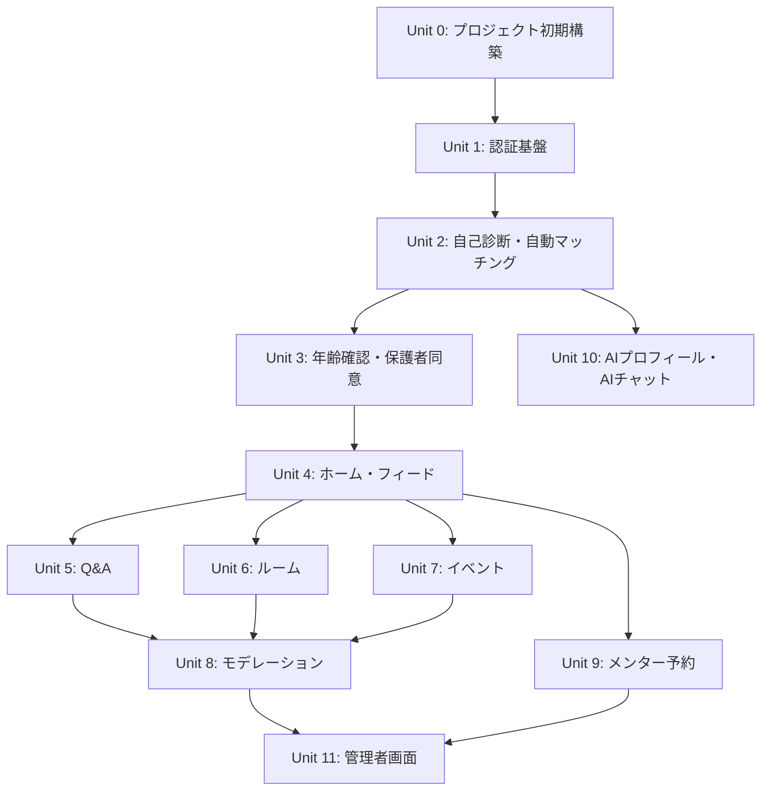
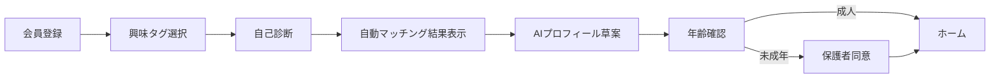

# ユニット分割（実装単位）

## 設計方針
**初回体験の価値を先に感じさせる**: 登録直後に自己診断→自動マッチングを体験させ、
プラットフォームの価値を理解してから年齢確認・保護者同意に進む。

## 依存関係図

## ユーザー初回フロー（変更後）

**ポイント**: 診断・マッチング結果を見せた後に年齢確認へ進む。
年齢確認完了前でも診断結果は保持され、完了後にホームで活用される。

---

## Unit 0: プロジェクト初期構築

**目的**: 開発基盤の構築。他の全ユニットの前提。

### スコープ
- Next.js プロジェクト作成（App Router）
- shadcn/ui + Tailwind CSS セットアップ
- Supabase プロジェクト接続設定
- ディレクトリ構成の作成
- 共通レイアウト（ルートレイアウト、認証レイアウト、メインレイアウト、管理者レイアウト）
- 共通UIコンポーネント（Header, BottomNav, PageHeader, LoadingSpinner, EmptyState, ErrorMessage）
- Supabase クライアント設定（client.ts, server.ts, middleware.ts）
- 型定義ファイル（types/）
- 定数ファイル（constants/roles, permissions, routes）
- Next.js Middleware（認証チェック骨格）
- 環境変数設定（.env.local.example）

### 成果物
- 動作する Next.js アプリのシェル
- 共通レイアウトが表示される状態
- Supabase 接続が確認できる状態

### 対応テーブル
なし（スキーマは各ユニットで作成）

### 推定ファイル数
約 25 ファイル

---

## Unit 1: 認証基盤

**目的**: 会員登録・ログイン・ログアウトの実装。全機能の前提。

### スコープ
- DB: `users` テーブル、Supabase Auth 連携トリガー
- 画面: LP / ログイン画面、会員登録画面
- コンポーネント: LoginForm, RegisterForm, SocialLoginButtons
- Server Actions: register, login, logout, password-reset, resend-verification
- Supabase Auth コールバック（`/api/auth/callback`）
- Middleware: 未認証ユーザーのリダイレクト
- ロール判定ヘルパー（`lib/auth/`）

### 対応機能要件
FR-AUTH-01 〜 FR-AUTH-05

### 受け入れ基準
- メール＋パスワードで登録・ログインできる
- メール確認メールが送信される
- 未ログインで保護ページにアクセスするとログイン画面へリダイレクト
- ログアウトで認証状態がクリアされる

### 推定ファイル数
約 15 ファイル

---

## Unit 2: 自己診断・自動マッチング

**目的**: 登録直後にプラットフォームの価値を体験させる。「どこに参加すればよいかわからない」を即座に解消。

### スコープ
- DB: `tags`, `user_tags`, `diagnosis_results`, `communities`, `community_tags` テーブル（マッチング用マスタデータ含む）
- 画面:
  - 興味タグ選択画面（登録直後に遷移）
  - 自己診断画面（3〜5問のウィザード形式）
  - マッチング結果画面（おすすめコミュニティ・ルーム・メンターのプレビュー）
- コンポーネント: TagSelector, DiagnosisWizard, DiagnosisResult, MatchingResultPreview, CommunityPreviewCard
- Server Actions: save-tags, submit-diagnosis, get-matching-results
- 自動マッチングロジック（タグ一致度 + 診断結果によるスコアリング）
- マッチング結果の保存（年齢確認後にホームで再利用）
- 診断スキップ時のフォールバック（人気コミュニティを表示）

### 対応機能要件
FR-ONB-01 〜 FR-ONB-05, FR-FEED-02（おすすめの基盤）

### 受け入れ基準
- 登録完了後、すぐにタグ選択画面に遷移する
- タグを複数選択して保存できる
- 自己診断（3〜5問）を完了できる
- 診断結果に基づき、おすすめコミュニティ・ルームがプレビュー表示される
- 「このコミュニティに参加するには年齢確認が必要です」の導線で年齢確認へ誘導
- 診断スキップ時も人気コミュニティが表示される
- 診断結果を後から再編集できる

### 推定ファイル数
約 16 ファイル

---

## Unit 3: 年齢確認・保護者同意

**目的**: 診断でプラットフォームの価値を体験した後、安全設計の基盤を確立する。

### スコープ
- DB: `verifications`, `guardian_consents` テーブル
- 画面: 年齢確認画面、保護者同意画面
- コンポーネント: AgeVerificationForm, ParentalConsentForm
- Server Actions: submit-verification, submit-consent
- ロール遷移: user → verified / minor
- Middleware 拡張: 年齢未確認ユーザーの制限（診断画面は許可、メイン機能は制限）
- 年齢確認完了後、Unit 2 の診断結果を引き継いでホームへ遷移

### 対応機能要件
FR-VERIFY-01 〜 FR-VERIFY-05

### 受け入れ基準
- 診断完了後に年齢確認画面へ誘導される
- 年齢確認未完了でもタグ・診断結果は保持されている
- 年齢確認未完了のユーザーはメイン機能（投稿、参加等）にアクセスできない
- 未成年は保護者同意完了まで投稿等が制限される
- 年齢区分（成人/未成年）がユーザーに保存される
- 年齢確認完了後、ホームにおすすめが表示される

### 推定ファイル数
約 12 ファイル

---

## Unit 4: ホーム・フィード・おすすめ

**目的**: メイン体験の起点となるホーム画面。

### スコープ
- DB: `communities`, `community_tags` テーブル
- 画面: ホーム / タグフィード画面、おすすめコミュニティ画面
- コンポーネント: FeedCard, FeedList, CommunityCard, TagFilterBar, SearchBar
- API Routes: GET /feed, GET /recommendations
- タグベースの絞り込み機能

### 対応機能要件
FR-FEED-01 〜 FR-FEED-05

### 受け入れ基準
- ホームに興味タグベースのフィードが表示される
- おすすめコミュニティが表示される
- タグ・カテゴリで絞り込みできる
- 安全ガイドへの導線がある

### 推定ファイル数
約 15 ファイル

---

## Unit 5: Q&A（公開質問・回答）

**目的**: 初心者が安全に質問できる中心機能。

### スコープ
- DB: `posts`, `comments`, `reactions` テーブル
- 画面: Q&A 一覧、Q&A 詳細、Q&A 投稿作成
- コンポーネント: QACard, QADetail, QAForm, CommentList, CommentForm, ReactionBar
- Server Actions: create-post, update-post, delete-post, create-comment, toggle-reaction, report-post
- テンプレート付き投稿フォーム

### 対応機能要件
FR-QA-01 〜 FR-QA-07

### 受け入れ基準
- テンプレ付きフォームで質問を投稿できる
- 回答コメントを投稿できる
- いいね等のリアクションができる
- 投稿の編集・削除ができる
- 通報ができる

### 推定ファイル数
約 18 ファイル

---

## Unit 6: ルーム

**目的**: 継続的で心理的安全性の高い居場所。

### スコープ
- DB: `rooms`, `room_memberships`, `room_profiles` テーブル
- 画面: ルーム一覧、ルーム詳細、ルーム参加、ルーム専用プロフィール編集
- コンポーネント: RoomCard, RoomHeader, RoomPostFeed, RoomPostForm, RoomProfileForm, JoinRoomButton
- Server Actions: join-room, leave-room, create-room-application, update-room-profile
- ルーム内投稿（posts テーブルの roomId 活用）
- 承認制ルーム対応

### 対応機能要件
FR-ROOM-01 〜 FR-ROOM-07

### 受け入れ基準
- ルーム一覧を閲覧・参加できる
- ルーム専用プロフィールを設定できる
- 承認制ルームは管理者承認後に参加可能
- 未成年が不許可ルームに入れない
- ルーム内投稿ができる

### 推定ファイル数
約 18 ファイル

---

## Unit 7: イベント

**目的**: コミュニティを点ではなく線にする。

### スコープ
- DB: `events`, `event_participations` テーブル
- 画面: イベント一覧、イベント詳細、イベント作成
- コンポーネント: EventCard, EventDetail, EventForm, JoinEventButton
- Server Actions: create-event, update-event, join-event, cancel-participation
- 未成年向け参加制限

### 対応機能要件
FR-EVT-01 〜 FR-EVT-06

### 受け入れ基準
- イベントを作成・閲覧できる
- 参加・キャンセルができる
- 未成年ユーザーに参加制限がかかる

### 推定ファイル数
約 14 ファイル

---

## Unit 8: モデレーション（ルールベース）

**目的**: 危険行為の一次検知。全コンテンツ系ユニット（Q&A, ルーム, イベント）に横断的に適用。

### スコープ
- DB: `reports`, `moderation_cases` テーブル
- ルールベースモデレーション（`lib/ai/moderation.ts`）
  - NGワードチェック
  - 外部SNS ID / URL 検出
  - 禁止パターンマッチング
- 通報機能の共通化
- 投稿時の自動判定（公開可 / 要注意 / 保留）
- 保留コンテンツの管理者レビューキュー送り

### 対応機能要件
FR-AI-MOD-01 〜 FR-AI-MOD-05

### 受け入れ基準
- NGワードを含む投稿が保留になる
- 外部SNS交換を示唆する投稿が警告/保留になる
- 通報が記録される
- 管理者がレビュー可能な状態でキューに入る

### 推定ファイル数
約 10 ファイル

---

## Unit 9: メンター予約制相談

**目的**: 安全な1on1相談の提供。

### スコープ
- DB: `mentor_profiles`, `booking_slots`, `consultation_bookings` テーブル
- 画面: メンター一覧、メンター詳細、相談予約
- コンポーネント: MentorCard, MentorDetail, BookingCalendar, BookingConfirm
- Server Actions: create-booking, cancel-booking, update-booking-status
- メンター申請フロー（認証済みメンターのみ受付）
- 未成年制限（認証済みメンターにのみ相談可能）

### 対応機能要件
FR-MTR-01 〜 FR-MTR-07

### 受け入れ基準
- 認証済みメンター一覧が表示される
- 空き枠を選んで予約できる
- 予約履歴が確認できる
- 自由DM導線が存在しない
- 非認証ユーザー同士では予約できない

### 推定ファイル数
約 16 ファイル

---

## Unit 10: AIプロフィール生成・AIチャットサポート（モック）

**目的**: AI支援機能のモック実装。

### スコープ
- DB: `ai_profile_drafts` テーブル
- 画面: AIサポート画面（チャット）
- コンポーネント: ChatWindow, ChatMessage, MockAIResponse, ProfileDraftPreview
- AIモックサービス（`lib/ai/chat.ts`, `lib/ai/profile-generator.ts`）
  - チャット: タグ選択支援、質問文整理のテンプレート応答
  - プロフィール: 興味タグ + 診断結果からテンプレート生成
- オンボーディング時のプロフィール草案提示

### 対応機能要件
FR-AI-CHAT-01 〜 FR-AI-CHAT-05, FR-AI-PROF-01 〜 FR-AI-PROF-04

### 受け入れ基準
- AIチャットで定型的な支援応答が返る
- プロフィール草案が生成・編集・保存できる
- AI回答に安全上の注意文が表示される

### 推定ファイル数
約 12 ファイル

---

## Unit 11: 管理者画面

**目的**: 安全運営の管理機能。

### スコープ
- DB: `audit_logs`, `notifications` テーブル
- 画面: 管理者ダッシュボード、通報管理、年齢確認審査、メンター審査、ルーム承認、イベント監視、NGワード設定、監査ログ
- コンポーネント: StatCard, ReportTable, ReviewQueue, NGWordEditor, AuditLogTable
- Server Actions: approve/reject-verification, approve/reject-mentor, approve/reject-room, stop-event, update-ng-words, suspend-user, delete-post
- 監査ログ記録
- 通知機能（承認/却下結果のユーザー通知）

### 対応機能要件
FR-ADMIN-01 〜 FR-ADMIN-08, FR-NOTI-01 〜 FR-NOTI-03

### 受け入れ基準
- ダッシュボードに未処理件数が表示される
- 各審査を承認/却下できる
- 操作履歴が監査ログに残る
- ユーザーに通知が届く

### 推定ファイル数
約 25 ファイル

---

## 実装順序サマリー

| 順序 | ユニット | 依存先 | 推定ファイル数 |
|---|---|---|---|
| 1 | Unit 0: プロジェクト初期構築 | なし | ~25 |
| 2 | Unit 1: 認証基盤 | Unit 0 | ~15 |
| 3 | Unit 2: 自己診断・自動マッチング | Unit 1 | ~16 |
| 4 | Unit 3: 年齢確認・保護者同意 | Unit 2 | ~12 |
| 5 | Unit 4: ホーム・フィード | Unit 3 | ~15 |
| 6-A | Unit 5: Q&A | Unit 4 | ~18 |
| 6-B | Unit 6: ルーム | Unit 4 | ~18 |
| 6-C | Unit 7: イベント | Unit 4 | ~14 |
| 6-D | Unit 9: メンター予約 | Unit 4 | ~16 |
| 7 | Unit 8: モデレーション | Unit 5,6,7 | ~10 |
| 3-A | Unit 10: AIモック | Unit 2 | ~12 |
| 8 | Unit 11: 管理者画面 | Unit 8,9 | ~25 |

**合計: 約 196 ファイル**

### 並行実装可能なグループ
- Unit 5, 6, 7, 9 は Unit 4 完了後に並行着手可能
- Unit 10 は Unit 2 完了後に着手可能（Unit 3 以降と並行可）
